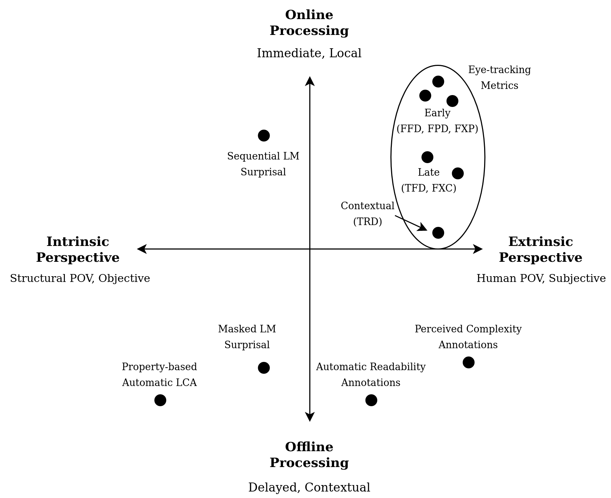
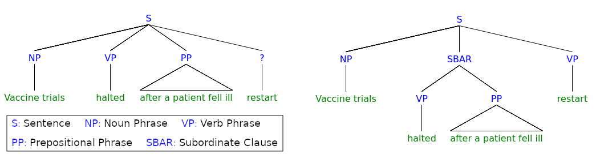

---
output:
  bookdown::word_document2: default
  bookdown::pdf_document2:
    template: ../templates/brief_template.tex
  bookdown::html_document2: default
documentclass: book
bibliography: ../references.bib
---

```{r echo=FALSE}
library(knitr)
```

```{block type='savequote', quote_author='(ref:sapir-1921-language)', include=knitr::is_latex_output()}
Both simple and complex types of language of an indefinite number of varieties may be found spoken at any desired level of cultural advance. When it comes to linguistic form, Plato walks with the Macedonian swineherd, Confucius with the head-hunting savage of Assam.
```
(ref:sapir-1921-language) --- Edward @sapir-1921-language, *Language*

<!-- Needed for leaving space to the quote, * is for no indentation after title -->

\titlespacing*{\chapter}{0pt}{80px}{35pt}

# **Linguistic Complexity** {#chap:ling-comp}
\minitoc  <!--this will include a mini table of contents-->

\chaptermark{Linguistic Complexity}

Defining linguistic complexity in a univocal way is challenging, despite the subjective intuition that every individual may have about what should be deemed complex in written or spoken language. Indeed, if the faculty of language allows us to produce a possibly infinite set of sentences from a finite vocabulary, there are infinitely many ways in which a sentence may appear difficult to a reader's eyes. An accurate definition is still debated in research fields like cognitive science, psycholinguistics, and computational linguistics. Nonetheless, it is indisputable that the concept of natural language complexity is closely related to difficulties in knowledge acquisition. This property stands both for human language learners and for computational models learning the distributional behavior of words in a corpus. 

This introductory chapter begins with a categorization of linguistic complexity annotations following taxonomical definitions found in the literature. Various complexity metrics are then introduced alongside corpora and resources that were used throughout this study. Finally, the focus will be put on garden-path sentences, peculiar syntactically-ambiguous constructs studied in the experiments of Chapter \@ref(chap:ex3).

## Categorizing Linguistic Complexity Measures {#subchap:categorizing}

In modern literature about linguistic complexity, two positions, each trying to define the nature of linguistic complexity phenomena, can be identified. In @kusters-2008-complexity words:

>On the one hand, complexity is used as a theory-internal concept, or linguistic tool, that refers only indirectly, by way of the theory, to language reality. On the other hand, complexity is defined as an empirical phenomenon, not part of, but to be explained by a theory.

\noindent
These definitions are coherent with the **absolute** and **relative complexity** terminology coined by @miestamo-2004-feasibility, where relative complexity is seen as a factor characterizing the perceptual experience of specific language users. In contrast, absolute complexity is structurally-defined by language constructs and independent from user evaluation. While these two perspectives seem to identify two opposite viewpoints over linguistic complexity, the distinction between the two becomes blurred when we consider that linguistic theories underlying absolute complexity evaluation are developed by linguists, who still have a subjective perspective despite their competence [@kusters-2003-linguistic]. Two definitions are now introduced to operationalize absolute and relative complexity in the context of complexity measurements:

[Intrinsic Perspective]{.custompar} The intrinsic perspective on linguistic complexity is closely related to the notion of absolute complexity. From the intrinsic viewpoint, language productions are evaluated using their distributional and structural properties, without any complexity annotation derived by language users. The linguistic system is characterized by a set of elementary components (lexicon, morphology, syntax *inter alia*) that interact hierarchically [@cangelosi-turner-2002-emergere], and their interactions can be measured in terms of complexity by fixing a set of rules and descriptions. The focus is on objectivity and automatic evaluation based on the intrinsic properties of language systems.

\vspace{-12pt}

[Extrinsic Perspective]{.custompar} The extrinsic perspective connects to the concept of relative complexity and takes into account the individual perspective of users. Complexity judgments are collected during or after the processing of linguistic productions and are then evaluated in terms of cognitive effort required by language users for comprehension. The extrinsic viewpoint is partaken by cognitive processing theories in psycholinguistics such as the Dependency Locality Theory [@gibson-1998-linguistic; @gibson-2000-dependency], the Surprisal Theory [@hale-2001-probabilistic; @hale-2016-information; @levy-2008-expectation], and the more recent Lossy-context Surprisal Theory [@futrell-2020-lossy], aiming to disentangle the source of processing difficulties in sentence comprehension. The focus, in this case, is on the subjectivity of language users and their judgments.

\vspace{10pt}

Despite being different under many aspects, the two perspectives are highly interdependent: a user's perception of complexity will be strongly influenced by the distributional and structural properties of utterances, and some of those properties will be considered complex in relation to the type of judgments they typically elicit in language users. Provided that the strength of human influence in complexity measurements can vary widely depending on data collection procedures, the two perspectives can be seen as the two ends of a spectrum. A visual representation is provided by the horizontal axis of the complexity measures compass in Figure \@ref(fig:compass).

```{r out.width = "100%", fig.cap="Complexity measures' compass.", label="compass", echo=FALSE}

```

An additional dimension for categorizing linguistic complexity metrics can be introduced by considering the time at which measures are obtained, relative to the incremental processing paradigm that characterizes natural reading in human subjects. In this context, *processing* is defined as any act aimed at extracting information from linguistic forms and structures, either by employing reasoning (in humans) or through computation (in automatic systems). Again, we can identify the two ends of a spectrum concerning processing modalities, related to the concepts of **local** and **global complexity** found in linguistic literature [@edmonds-1999-syntactic; @miestamo-2004-feasibility; @miestamo-2008-grammatical]:

[Online processing]{.custompar} Online complexity judgments are collected while a language user, be it a human subject or a computational system, is sequentially processing a text. Online processing is widely explored in the cognitive science literature, where behavioral metrics such are fMRI data and gaze recordings are collected from subjects exposed to locally and temporally-immediate inputs and tasks that require fast processing [@iverson-thelen-1999-hand]. The act of reading is predominantly performed by online cognition [@meyer-rice-1992-prose], making online measures especially suitable for complexity evaluation for natural reading.

\vspace{-12pt}

[Offline processing]{.custompar} Offline complexity judgments are collected at a later time when the language user has a complete and contextual view of the text in its entirety. Again, offline complexity is related to the offline cognition paradigm [@day-2004-religion] typically used in re-evaluations and future planning. In practice, offline evaluation accounts for contextual and cultural factors closely related to individual subjectivity and is poorly captured by immediate online metrics.

\vspace{10pt}

Figure \@ref(fig:compass) situates various linguistic complexity metrics in terms of processing modalities and analyzed perspective by including the processing spectrum on the vertical axis. In the next sections, all these measures will be introduced and their use will be motivated in light of this categorization.


## Intrinsic Perspective {#subchap:intrinsic}

Complexity studies where the intrinsic point of view is adopted rely on annotations describing linguistic phenomena and structures in sentences and aim to map those to complexity levels or ratings, often resorting to formulas parametrized through empirical observation. Given the scarcity of experienced human annotators and the cost of a manual annotation process, computational systems have been primarily employed to extract linguistic information from raw text in an automated yet precise way.

Another intrinsic viewpoint is based on the intuition that frequent constructs should be deemed as less complex than infrequent ones. In this case, terms' co-occurrences are extracted from large corpora, and complexity judgments are derived from their probabilistic likelihood of appearance in a given context. Given the infeasibility of tracking co-occurrences for long sequences in large, typologically-varied corpora, **computational language models** are usually employed to learn approximations of co-occurrence likelihoods for specific constructs.

While this thesis work only partially addresses the use of these approaches, they will be briefly introduced to provide additional context for understanding extrinsic perspectives and their experimental evaluation.

### Structural Linguistic Complexity {#subsubchap:structural}

Language systems can be seen as hierarchies of rules and processes governing various aspects of utterances production and use. For each of those levels, it is possible to identify characteristics leading to higher complexity from a structural standpoint [@sinnemaki-2011-language]:

- A greater number of parts in a specific language level leads to a greater **syntagmatic complexity** (also known as *constitutional complexity*). This mode is related to the *lexical* and "superficial" properties of language, such as the length of words and sentences.

- A greater variety of parts in a specific language level leads to a greater **paradigmatic complexity** (also known as *taxonomic complexity*). This mode characterizes, in particular, the *phonological* level, where the presence of an elaborated tonal system makes a language more complex [@mcwhorter-2001-world],  the *morphologic* level, where inflectional morphology is usually associated to a higher degree of complexity [@mcwhorter-2001-world; @kusters-2003-linguistic] when compared to the regularity of derivational rules, and the *semantic* level, where polysemic words are generally considered more complex than monosemic ones [@voghera-2001-riflessioni].

- A greater variety of interrelation modalities and hierarchical structures leads to greater **organizational and hierarchical complexities**. Those complexity modes are mainly related to the *syntactic level*, where recursive and nested constructs are deemed more complex and possibly determinant in distinguishing human language from animal communication [@hauser-2002-faculty].

Focusing on the syntactic level, we can find multiple factors accounting for greater complexity [@berruto-2011-linguistica]:

- Subordinate clauses preceding the main clause, as in *[If you need help]{.underline}, let me know"* as opposed to *"Let me know [if you need help]{.underline}"*. 

- Presence of long-range syntactic dependencies between non-contiguous elements, as in *"[The dog]{.underline} that the cat chased for days [ran away]{.underline}"* where the subject referent (*dog*) and its verb (*ran*) are far apart in the sentence.

- A high degree of nesting between elements and substructures, as in *"The mouse __that the cat__ [that the dog bit]{.underline} __ate__ was bought at the fair"* where two nested subordinate clauses introduced by the preposition *that* are present.

- Repeated applications of recursive principles to build utterances with different meanings through the compositionality principle, as in *"I am a huge fan [of fans]{.underline} of fans of ... of recursion"*, where the number of recursions defines the final meaning of the sentence.

While all those properties are relevant when evaluating an utterance's complexity, only some can be easily extracted from corpora using automatic approaches. In the specific context of this work, the analysis of complexity-related features in Chapter \@ref(chap:ex1) makes use of the Profiling--UD tool^[Available at http://linguistic-profiling.italianlp.it] [@brunato-etal-2020-profiling], implementing a two-stage process: first, the linguistic annotation process is automatically performed by UDPipe [@straka-etal-2016-udpipe], a multilingual pipeline leveraging neural parsers and taggers included in the Universal Dependencies initiative [@nivre-etal-2016-universal]. During this step, sentences are tokenized, lemmatized, POS-tagged (i.e., words are assigned lexical categories such as "Noun" and "Verb") and parsed (i.e., the hierarchical structure of syntactic dependencies is inferred). Then, a set of about 130 linguistic features representing underlying linguistic properties of sentences is extracted from various levels of annotation. Those features account for multiple morphological, syntactic, and "superficial" properties related to linguistic complexity. A relevant subset of those features is presented in detail in Appendix \@ref(app:ling-feats). 

After deriving linguistic properties from sentences, either automatically as in this study or by manual annotations, two approaches are viable to determine their complexity while maintaining an intrinsic perspective (no human processing data involved):

\vspace{-12pt}

[Formula-based Approach]{.custompar} This approach treats linguistic properties of input texts as components of a formula used to determine levels or readability grades. Traditional readability formulas consider multiple factors, such as word length, sentence length, and word frequency. Parameters in those formulas are carefully hand-tuned to match human intuition and correlate well with human-graded readability levels.^[This motivates the previous claim about the interdependence of intrinsic and extrinsic approaches. See Section 2.1 of @martinc-2019-supervised for an overview of the most popular metrics for English.]

\vspace{-12pt}

[Learning-based Approach]{.custompar} This approach casts the complexity prediction problem in the supervised machine learning framework. More specifically, linguistic parsers are used to predict linguistic properties, and their accuracy on a set of gold-labeled instances is taken as an indicator of complexity. In the case of dependency parsers (i.e., models trained to extract the syntactic structure of a sentence), two evaluation metrics can be used: the *Unlabeled and Labeled Attachment Scores* (UAS and LAS), where the UAS is the percentage of words assigned to the right dependency head and LAS also consider if the dependency relation was labeled correctly.

Both approaches are represented in Figure \@ref(fig:compass) under the label "Property-based Automatic LCA" and are considered offline since the text is generally not processed incrementally but instead taken as a whole.

### Language Modeling Surprisal {#subsubchap:lm-surprisal}

The information-theoretic concept of **surprisal**, also known as *information content* of an event, can be seen as a quantification of the level of surprise caused by a specific outcome: an event that is certain yields no information, while the less probable an event is, the more surprising it gets. Formally, an event $x$ with probability $p(x)$ has a surprisal value equal to:

\begin{equation}
I(x) = - \log[p(x)]
\end{equation}

The idea that probabilistic expectations in the context of language reading are related to greater complexity in terms of cognitive processing was formalized by *surprisal theory* [@hale-2001-probabilistic; @hale-2016-information]. Surprisal theory defines processing difficulties $D$ (which can be considered as proxies of complexity) as directly proportional to the surprisal produced in readers by a word $w$ given its previous context $c$ (i.e., preceding words in the sentence):

\begin{equation}
D(w_i|c) \propto -\log p(w_i|c) = -\log p(w_i|w_i-1, w_i-2,\dots, w_0)
\end{equation}

While processing difficulties imply human subjects' presence, **language models** (LM) can be used to estimate the conceptually similar information-theoretic surprisal without the need of human annotations by learning word occurrences and co-occurrences probabilities from large quantities of text. Concretely, a language model is a probabilistic classifier that learns to predict a probability distribution over words of a vocabulary $V$ given a large number of contexts $c$ in which those words occur [@goodman-2001-bit]:

\begin{equation}
p(w_i|c) \quad \forall\ w_i\in V
\end{equation}

After the training procedure it is possible to estimate the probability $p(s)$ of a sentence $s$ having length $m$ as the product of the conditional probabilities assigned to individual words by the language model, given its context:

\begin{equation}
p(s) = p(w_1, \dots, w_m) = \prod_{i=1}^m p(w_i \ |c)
(\#eq:sent-surprisal)
\end{equation}

We can consider the surprisal $I(s) = -\log p(s)$ as an *intrinsic measure* of linguistic complexity since it is a function of the co-occurrence relations derived by the training corpora. Thus, it describes how likely a construct can be observed in a structurally-sound manner, without relying on human processing data. However, automatic surprisal estimation using language models cannot be considered purely intrinsic since it is highly dependent on a multitude of factors that are arguably "less objective" than the linguistic categories of the previous section, such as the type and dimension of the considered context and the corpora employed by the LM to learn words' distributional behavior.

We can categorize modern language models in two broad categories: **sequential** models (also known as *autoregressive* or *causal* LMs) consider as context only preceding words, while **bidirectional** models (also known as *masked* LMs) consider both preceding and following words when estimating occurrence probabilities, much like the well-established *cloze test* [@taylor-1953-cloze] in psycholinguistics. Equations \@ref(eq:sent-surprisal-cases) show how the sentence surprisal equation \@ref(eq:sent-surprisal) is adapted in both cases, using the product rule for logarithms:

\begin{equation}
\begin{split}
I_{\mathrm{sequential}}(s) & = - \sum_{i=1}^m \log p(w_i \ | w_1, w_2, \dots, w_{i-1})\\
I_{\mathrm{bidirectional}}(s) & = - \sum_{i=1}^m \log p(w_i \ | w_1, \dots, w_{i-1}, w_{i+1}, \dots, w_m)
\end{split}
(\#eq:sent-surprisal-cases)
\end{equation}

If the LM used to estimate surprisal was sequential, then surprisal estimation could be considered part of the *online processing paradigm* despite the absence of a human subject.^[This is an admittedly simplistic reduction, given the importance of parafoveal processing in reading [@schotter-2012-parafoveal; @schotter-2018-reading]] In the bidirectional case, the estimation of surprisals from the whole context can be assimilated with offline processing practices.

The relation between co-occurrence frequencies estimated by a language model and perception of complexity is one of the aspects that make language models especially suitable for predicting extrinsic complexity metrics, as it will be discussed in Chapter \@ref(chap:models).

## Extrinsic Perspective {#subchap:extrinsic}

Extrinsic complexity measures elicited from human-produced signals and annotations are the main focus of this thesis work. In this section, three different viewpoints on linguistic complexity assessment from a human perspective are introduced:

- The **readability** point-of-view, as intended in the context of the *automatic readability assessment* (ARA) task, is concerned with collocating similar textual inputs into difficulty levels that are often predetermined by writers and given a clear semantic interpretation (e.g., easy, medium, hard).

- The **perceptual** point-of-view, represented by the *perceived complexity prediction* (PCP) task, is based on human annotations of complexity on a numeric scale, taking into account disparate textual inputs presented sequentially to obtain more generalizable complexity annotations. Unlike ARA, PCP annotations are produced by readers after sentence comprehension.

- The **cognitive** point-of-view, employing cognitive signals collected by specialized machinery (e.g., electrodes, MRI scanners, eye-trackers) as proxies for the linguistic complexity experienced by users. In this work, the focus will be on the *gaze metrics prediction* task, using gaze data collected from subjects during natural reading.

All three complexity-related tasks will be introduced alongside recent results in the literature. The corpora on which each task relies upon will also be presented in their respective sections.

### Automatic Readability Assessment {#subsubchap:readability}

While the term *readability assessment* is often broadly employed to denote the task of predicting the general reading difficulty of a text, here it is used to describe the typical approach in ARA, relying on corpora categorized by the writer's perception of what is difficult for readers.

We can take as an example the OneStopEnglish (OSE) corpus [@vajjala-lucic-2018-onestopenglish], which will be used later to study the ARA relation with other complexity tasks in Chapter \@ref(chap:ex2). OSE contains 567 weekly articles from The Guardian newspaper rewritten by language teachers to suit three adult English learners' levels. Each text can be divided into passages spanning one or multiple sentences, each labeled with a readability level ("Elementary", "Intermediate" or "Advanced") based on the original writers' judgment. An example of the same passage at different reading levels is provided in Table \@ref(tab:ose-example).

```{r echo=FALSE}
library(kableExtra)
ose_ex <- data.frame(
  Level = c("Advanced (Adv)", "Intermediate (Int)", "Elementary (Ele)"),
  Example = c("Amsterdam still looks liberal to tourists, who were recently assured by the Labour Mayor that the city’s marijuana-selling coffee shops would stay open despite a new national law tackling drug tourism. But the Dutch capital may lose its reputation for tolerance over plans to dispatch nuisance neighbours
to scum villages made from shipping containers.", "To tourists, Amsterdam still seems very liberal. Recently the city’s Mayor assured them that the city’s marijuana-selling coffee shops would stay open despite a new national law to prevent drug tourism. But the Dutch capitals plans to send nuisance neighbours to scum villages made from shipping containers may damage its reputation for tolerance.", "To tourists, Amsterdam still seems very liberal. Recently the city’s Mayor told them that the coffee shops that sell marijuana would stay open, although there is a new national law to stop drug tourism. But the Dutch capital has a plan to send antisocial neighbours to scum villages made from shipping containers, and so maybe now people wont think it is a liberal city any more.")
)
ose_ex %>% kable(booktabs=T, caption="An OSE Corpus passage at different reading levels.", col.names = c("Reading Level", "Example"), label = "ose-example", linesep = "\\addlinespace\\hline\\addlinespace") %>% 
  kable_styling() %>%
  column_spec(2, width="29em") %>%
  row_spec(0, bold=T)
```

From Table \@ref(tab:ose-example) example, it is evident that the reading level of a specific text should be interpreted only in relation to its other versions, i.e., elementary passages are not necessarily straightforward in absolute terms, but rather *less complicated than their intermediate and advanced counterparts*. This affirmation holds for the OSE corpus and other widely-used readability corpora such as the Newsela corpus [@xu-etal-2015-problems], which contains newspaper articles rewritten by experts to match eleven school grade reading levels. For this reason, and because of its writer-centric perspective relying only on readability judgments formulated by the same writers who composed the passages, readability assessment is fundamentally different from the other extrinsic approaches.^[See @collins-2014-computational for  a thorough review of ARA approaches.] ARA can be framed as a machine learning task in which a computational model $m$ is trained to predict the readability level $y \in \mathcal{Y}$ over a set of labeled examples $\mathcal{S} = (s_1, s_2, \dots, s_n)$ in two possible ways:

- A simple multiclass classification setting, where the model predicts the level of a single sentence $s$. In this case, the model outputs a prediction $m(s) = \hat y \in \mathcal{Y}$. We can then minimize the categorical cross-entropy $H(y, \hat y)$ between gold and predicted labels during the training process and evaluate the model's performances with standard classification metrics such as precision and recall. This approach is similar to the ones used for other extrinsic metrics but does not account for readability levels' relative nature.

- A multiple-choice scenario, where the model is provided with two semantically equivalent sentences $s_1, s_2$ at different readability levels ($s_1 \equiv s_2, y_1 \neq y_2$) and needs to predict which of the sentences has the highest readability level. In this case, which is more coherent with the relative nature of readability judgments, the model is trained to minimize the binary cross-entropy between gold and predicted labels $y, \hat y \in \mathcal{Y}_{bin} = \{0,1\}$ corresponding to the position of the more complex sentence in the pair.

Expert annotations' effectiveness in determining readers' comprehension was recently questioned, as automatic readability scoring did not show a significant correlation to comprehension scores of participants, at least for the OSE Corpus [@vajjala-lucic-2019-understanding]. However, measuring if this observation holds for other corpora and extrinsic approaches is beyond this thesis's scope.

### Perceived Complexity Prediction {#subsubchap:pc}

While ARA measures linguistic complexity in a context-relative and writer-centric sense, the *perceived complexity prediction* (PCP) approach focuses on eliciting absolute complexity judgments directly from target readers, aiming at evaluating difficulties in comprehension rather than production. This approach was pioneered by @brunato-etal-2018-sentence, who collected crowdsourced complexity ratings from native speakers for Italian and English sentences and evaluated how different structural linguistic properties contribute to human complexity perception. The use of annotators recruited on a crowdsourcing platform was intended to better grasp the layman's perspective on linguistic complexity, as opposed to ARA expert writers. If collected properly, crowdsourced annotations were shown to be highly reliable for linguistics and computational linguistics research by the survey of @munro-etal-2010-crowdsourcing.

@brunato-etal-2018-sentence extracted 1200 sentences from both the newspaper sections of the Italian Universal Dependency Treebank (IUDT) [@simi-etal-2014-less] and the Penn Treebank [@mcdonald-etal-2013-universal], such that those are equally distributed in term of length. To collect human complexity judgments, twenty native speakers were recruited for each language on a crowdsourcing platform. Annotators had to rate each sentence's difficulty on a Likert 7-point scale, with 1 meaning "very simple" and 7 "very complex". Sentences were randomly shuffled and presented in groups of five per web page, with annotators being given a minimum of ten seconds to complete each page to prevent skimming. The quality of annotations was measured using the Krippendorff alpha reliability, obtaining 26% and 24% for Italian and English. Table \@ref(tab:pc-example) presents an example of English sentences labeled with multiple annotators' perceived complexity judgments.

```{r echo=FALSE}
pc_ex <- data.frame(
  Example = c("In other European markets, share prices closed sharply higher in Frankfurt and Zurich and posted moderate rises in Stockholm, Amsterdam and Milan.", "The pound strengthened to $ 1.5795 from $ 1.5765.", "In Connecticut, however, most state judges are appointed by the governor and approved by the state legislature.", "When the market stabilized, he added, the firm sold the bonds and quickly paid the loans back.", "Paribas already holds about 18.7 % of Navigation Mixte, and the acquisition of the additional 48 % would cost it about 11 billion francs under its current bid."),
  Annotator_1 = c(4, 2, 1, 2, 5),
  Annotator_2 = c(6, 1, 3, 3, 2),
  Annotator_3 = c(7, 2, 3, 3, 3),
  Dots = c("...", "...", "...", "...", "..."),
  Annotator_20 = c(1, 1, 5, 3, 6)
)
pc_ex %>% kable(booktabs=T, caption="Sample of sentences taken from the English portion of the Perceived Complexity (PC) Corpus with complexity scores from crowdsourced annotators.", col.names = c("Sentence", "A1", "A2", "A3", "...", "A20"), label = "pc-example", align = c('l', rep('c', times=5)), linesep = "\\addlinespace\\hline\\addlinespace") %>% 
  kable_styling() %>%
  column_spec(1, width="25em") %>%
  row_spec(0, bold=T)
```

As can be expected, PC judgments show significant variability across participants since they cannot be easily framed in a relative setting. Since this work's focus is related to a general notion of complexity, PC judgments are averaged and filtered to obtain a score reflecting the mean perception of complexity of all participants in experimental chapters. The averaged score is later treated as the gold label in a regression task, with machine learning models trained to minimize the *mean square error* between their predictions and gold average annotations. Another possibility, which is not explored in this thesis work, would be to consider only single participants' judgments to model their linguistic complexity perception.

### Gaze Metrics Prediction {#subsubchap:eye-tracking}

Gaze data collected from human subjects during reading can provide us with useful insights from an online extrinsic complexity perspective. Patterns found in both *saccades*, i.e., eye movements from one location to another, and *fixations*, where eyes are relatively stable while fixating a specific region, were shown to be reliably linked to a multitude of linguistic factors [@demberg-keller-2008-data]. Because of this, a linking assumption between overt attention and mental processing can be reasonably established, and gaze metrics can be considered as proxies of cognitive effort, and thus of complexity, at various processing levels.^[See @rayner-1998-eye for a comprehensive survey on findings related to eye-tracking research.]

Gaze metrics are widely employed in cognitive processing research because of their multiple benefits: optical eye-tracking systems are non-invasive and relatively inexpensive compared to other approaches that directly measure brain activity, such as electroencephalography (EEG) and all magnetic resonance imaging (MRI) variants. Moreover, gaze data generally have high spatial and temporal precision, limited only by sampling rates, which are generally in the order of few milliseconds. This aspect is crucial for reading research since it allows us to directly associate gaze measures to specific *areas of interest* (AOI, also called region), i.e., small portions of the visual input provided to participants.

\vspace{-12pt}

[Gaze data for NLP]{.custompar} Eye-tracking data and other cognitive signals were effectively used in many NLP applications such as POS tagging [@barrett-etal-2016-weakly], sentiment analysis [@mishra-etal-2017-learning], native language identification [@berzak-etal-2018-assessing], and dependency parsing [@strzyz-etal-2019-towards] *inter alia*, often providing modest yet consistent improvements across models and tasks through the combination of gaze features and linguistic features or distributed representations.^[See @hollenstein-etal-2020-towards for an exhaustive overview of current approaches and best practices.] In the context of linguistic complexity assessment, eye-tracking data were applied to the ARA task for both monolingual and bilingual participants, obtaining meaningful results for sentence-level classification in easy and hard-to-read categories [@vasishth-etal-2013-what; @ambati-etal-2016-assessing]. For example, @singh-etal-2016-quantifying first use a set of linguistic features to learn a reading times model from a set of gaze-annotated sentences and then use models' predicted times over a second set of sentences to perform multiple-choice ARA. @gonzalez-garduno-sogaard-2018-learning extend this approach in a multitask learning setting [@caruana-1997-multitask; @ruder-2017-overview], using eye-movement prediction tasks to produce models able to predict readability levels both from a native speaker and foreign language learner perspective.

\vspace{-12pt}

[Collecting Eye-tracking Data]{.custompar} A typical procedure to collect gaze data for reading research, as described by @schotter-2020-eyetracking, usually includes the following steps:

- Textual inputs are selected and split by experiment designers, first in areas of interest directly mapped to pixels (for natural reading, usually word boundaries), then over multiple rows, and finally in screens presented to participants. This step should take into account calibration errors to determine the correct level of tolerance for off-word fixations.

- A participant is placed in a room with a display computer used to present visual inputs and a host computer used to record data from the eye-tracker setup. Optical eye-trackers use infrared light beams, which are reflected differently by different parts of the eye, to measure pupil and corneal reflection and track gaze movements at each timestep. The setup is calibrated and validated for each participant to ensure the quality of results.

- Each participant follows the on-screen instructions to complete a reading task trial while remaining at a fixed distance from the screen. A *fixation report* containing events (saccades, fixations, blinks) is produced for each individual on the host computer.

- Finally, a data preprocessing step is taken for each trial to identify and remove artifacts and possibly decide to reject the trial. Some examples of standard practices are the merge of fixations below 80ms due to eye jittering, the exclusion of fixations caused by track loss after blinks, and vertical drift correction [@carr-etal-2020-algorithms]. An *AOI report* containing gaze metrics grouped at AOI level can be produced.

[Eye-tracking Metrics]{.custompar} Metrics derived from the AOI report contain information about the processing phases in which subjects incur during sentence comprehension. *Early gaze measures* capture information about lexical access and early processing of syntactic structures, while *late measures* are more likely to reflect comprehension and both syntactic and semantic disambiguation [@demberg-keller-2008-data]. The third kind of measures, referred to as *contextual* following the categorization in @hollenstein-zhang-2019-entity, capture information from surrounding content. Table \@ref(tab:et-metrics) presents a subset of metrics, spanning the three categories, that will be used in the experimental section.^[Appendix \@ref(app:et-metrics) contains information about deriving metric values for all corpora.] These metrics represent a minimal group spanning various stages of the reading process and are leveraged to study differences between online and offline processing among extrinsic metrics. In the experimental part, gaze scores are often averaged across participants to reduce noise in measurements and obtain a single label for each metric that can later be used as a reference in a regression setting. The average fixation probability across participants for each AOI is a value comprised in the range $[0,1]$ and represents the proportion of subjects that accessed the region during their first gaze pass.

```{r echo=FALSE}
et_metrics <- data.frame(
  Metric_Level = c("Early", "Early", "Early", "Late", "Late", "Contextual"),
  Metric = c("First Fixation Duration (FFD)", "First Pass Duration (FPD)", "Fixation Probability (FXP)", "Fixation Count (FXC)", "Total Fixation Duration (TFD)", "Total Regression Duration (TRD)"),
  Description = c("Duration of the first fixation over the region, including single fixations.", "Duration of the first pass over a region.", "Boolean value reflecting if the region was fixated or skipped during the first pass.", "Number of total fixations over a region.", "Sum of all fixation durations over a region.", "Duration of regressive saccades performed after a region's first access and before going past it.")
)
et_metrics %>% kable(booktabs=T, caption="Eye-tracking metrics used in this study.", col.names = c("Type", "Metric Name", "Description"), label = "et-metrics", align = c(rep('l', times=3)), linesep = "\\addlinespace") %>% 
  kable_styling() %>%
  column_spec(3, width="17em") %>%
  row_spec(0, bold=T) %>% 
  collapse_rows(1, valign="top", custom_latex_hline = c(2,3))
```

[Eye-tracking Corpora]{.custompar} The experimental part of this thesis work leverages four widely used eye-tracking resources: the Dundee corpus [@kennedy-etal-2003-dundee], the GECO corpus [@cop-etal-2017-presenting], the ZuCo corpus [@hollenstein-2018-zuco], and ZuCo 2.0 [@hollenstein-etal-2020-zuco]. There are multiple reasons behind the choice of using multiple gaze-annotated corpora for this study. First, those corpora span different domains and provide us with a better intuition of what structures are perceived as complex in different settings and by different pools of subjects. Secondly, neural-network-based complexity models used in this work greatly benefit from a broader availability of annotated data to achieve higher performances in predicting eye-tracking metrics. Finally, while all corpora relied on different procedures and instrumentation, they are all derived from very similar experimental settings (i.e., natural reading on multiple lines), and can be easily merged after an individual normalization procedure [@hollenstein-zhang-2019-entity]. Table \@ref(tab:et-corpora) presents some descriptive statistics of the four corpora.

- The **Dundee Corpus** developed by @kennedy-etal-2003-dundee contains gaze data for ten native English speakers tasked with reading twenty newspaper articles from *The Independent*. The English section of the Dundee corpus includes 51,240 tokens in 2368 sentences. Texts were presented to subjects on a screen five lines at a time and recorded using a *Dr. Bois Oculometer Eyetracker* with 1 kHz monocular (right) sampling. Dundee corpus data are the oldest among selected corpora and have been extensively used in psycholinguistic research about naturalistic reading.

- The **Ghent Eye-tracking Corpus** (GECO) by @cop-etal-2017-presenting was created more recently to study eye movements of both monolingual and bilingual subjects during naturalistic reading of the novel *The Mysterious Affair at Styles* by Agatha @christie-2003-mysterious. In the context of this work, only the monolingual portion collected from 14 native English speakers is used, comprising 56,409 tokens in 5,387 sentences. Eye movements were recorded with an *EyeLink 1000* system with 1 kHz binocular sampling (only right eye movements were considered), and the text was presented one paragraph at a time.

- The **Zurich Cognitive Language Processing Corpus** (ZuCo) by @hollenstein-2018-zuco is a dataset including both eye-tracking and EEG measurements collected simultaneously during both natural and task-oriented reading. The corpus contains 1100 English sentences from the Stanford Sentiment Treebank [@socher-etal-2013-recursive] and the Wikipedia dump used in @culotta-etal-2006-integrating with gaze data for 12 adult native speakers. Only the first two portions are used for the present work since they contain natural reading data, totalizing 700 sentences and 13,630 tokens. The text was presented on-screen one sentence at a time, and data were collected with an *EyeLink 1000* as for GECO.

- **ZuCo 2.0** is an extension of ZuCo, including 739 sentences extracted from the Wikipedia corpus by @culotta-etal-2006-integrating. Only the 349 sentences for which natural reading data were collected are used, and the 100 duplicates shared with ZuCo to evaluate differences in setup and participants are removed. Data were collected from 18 native English speakers using an *EyeLink 1000 Plus* with 500 kHz sampling.

```{r echo=FALSE}
et_data <- data.frame(
  Rows = c("domain(s)", "# of sentences", "mean sent. length", "# of tokens", "unique token types", "mean token length", "mean fix. duration", "mean gaze duration"),
  Dundee = c("news", 2368, 21.64, 51240, 9928, 4.88, 200, 280),
  GECO = c("literature", 5387, 10.47, 56409, 6155, 4.60, 210, 234),
  ZuCo = c("movie reviews, Wiki articles", 700, 19.47, 13630, 4650, 5.05, 117, 139),
  ZuCo2 = c("Wiki articles", 349, 19.51, 6810, 2521, 5.01, 117, 134),
  Total = c("-",8804, 17.77, 128089, 16320, 4.89, 161, 197)
)
et_data %>% kable(booktabs=T, caption="Descriptive statistics of eye-tracking corpora.", col.names = c("", "Dundee", "GECO", "ZuCo", "ZuCo 2.0", "Total"), label = "et-corpora", align = c('l', rep('c', times=5)), linesep = "") %>% 
  kable_styling() %>%
  column_spec(4, width="8em") %>%
  column_spec(5, border_right = T) %>% 
  row_spec(0, bold=T)
```

Tokens are obtained using whitespace tokenization, which is the same approach used to perform gaze annotations across all eye-tracking corpora. Mean sentence length is expressed in number of tokens, and the number of unique types is computed as the size of the vocabulary after removing punctuation from all tokens. Approximately 128,000 tokens annotated with gaze recordings from multiple participants were used in the experiments of Chapters \@ref(chap:ex2) and \@ref(chap:ex3), while only GECO was used for the analysis of Chapter \@ref(chap:ex1). Similarly to the PCP task, scores were averaged across subjects to reduce noise and obtain general estimates: in particular, reading times that were missing due to skipping were considered as having the lowest duration across annotators, which is a practice commonly used in literature. Again, considering individual participants' scores is deemed attractive in a personalization perspective but far beyond this work's scope.

## Garden-path Sentences {#subchap:garden-path}

```{r out.width = "100%", fig.cap="Syntax trees for the initial and complete parse of garden-path example (1).", label="syntax-trees", echo=FALSE}

```

**Garden-path sentences**, named from the expression "leading down the garden path" implying deception, are grammatically correct sentences that create a momentarily ambiguous interpretation in readers. The initial interpretation is later falsified by words encountered during sequential reading, becoming a significant source of processing difficulties. For this reason, garden-path constructions are used to evaluate models of linguistic complexity in the experiments of Chapter \@ref(chap:ex3). Consider the following recent headline by the newspaper *The Guardian*:^[https://twitter.com/drswissmiss/status/1304856856649756673]

> (1) Vaccine trials halted after patient fell ill [restart]{.underline}.

Readers exposed to (1) tend to initially prefer the interpretation in which halted acts as the main verb of the sentence in simple past, i.e., *"Vaccine trials halted after patient fell ill."* is interpreted as a well-formed and semantically meaningful sentence. When the verb *restart* is reached, it suddenly becomes evident that the original parse would lead to an ungrammatical sentence, and a reanalysis requiring nontrivial cognitive processing is triggered. In conclusion, one understands that *halted* is used as a passive participle, and *Vaccine trials* are the subordinate clause's direct object, as shown in Figure \@ref(fig:syntax-trees). We can rephrase the sentence with minimal changes to make it unambiguous:

> (2) Vaccine trials that were halted after patient fell ill restart.

The choice for the initial parse can be explained in terms of frequency of occurrence: subject-verb-object sentences are encountered much more frequently than ones containing reduced relatives in everyday settings, making the first parse more likely [@fine-2013-rapid]. We refer to the verb causing the reanalysis as *disambiguator*, and to the difference in cognitive processing between (1) and (2), measured using proxies such as gaze metrics, as *garden-path effect* [@bever-1970-cognitive].

@schjindel-linzen-2020-single present two families of cognitive processing theories trying to motivate the underlying difficulties in which humans incur with garden-path sentences:

- *Two-stage accounts* assume that readers consider only one or a subset of possible parses for each sentence that it is reading [@gibson-1991-computational; @jurafsky-1996-probabilistic], and processing difficulties arise as a consequence of the reanalysis process need to reconstruct parses that were initially disregarded or not considered [@frazier-1978-sausage].

- *One-stage accounts* such as **surprisal theory** [@hale-2001-probabilistic; @levy-2008-expectation] instead consider difficulties produced by garden paths as the products of a single processing mechanism. Dispreferred parses are not discarded, but rather associated with a lower probability compared to that of likely ones: "processing difficulty on every word in the sentence, including the disambiguating words in garden-path sentences, arises from the extent to which the word shifts the reader's subjective probability distribution over possible parses" [@schjindel-linzen-2020-single].

There are multiple types of garden-path sentences, usually categorized based on their respective syntactic ambiguities [@frazier-1978-comprehending]. In this work, two classic garden-path families are studied in three different settings using examples taken from @futrell-etal-2019-neural. The first type is the **MV/RR ambiguity** presented in example (1), and repeated in (3a):

> (3) a. The woman brought the sandwich [fell]{.underline} in the dining room. [[RED., AMBIG.]]{.verysmall}

> b. The woman who was brought the sandwich fell in the dining room. [[UNRED., AMBIG.]]{.verysmall}

> c. The woman given the sandwich fell in the dining room. [[RED., UNAMBIG.]]{.verysmall}

> d. The woman who was given the sandwich fell in the dining room. [[UNRED., UNAMBIG.]]{.verysmall}

The label MV/RR indicates that *brought* can be initially parsed either as the main verb (MV) in the past tense of the clause or as a passive participle introducing a reduced relative (RR) clause, which postmodifies the subject. It is possible to rewrite the sentence by changing the ambiguous verb to an equivalent one having different forms for simple past and past participle (such as *gave* vs. *given*). In this case, we expect that the difference in cognitive processing for the disambiguator *fell* between the reduced (3c) and the unreduced (3d) version is smaller since the ambiguity is ruled out from the beginning.

The second type of ambiguity is the **NP/Z ambiguity** presented in (4a):

> (4) a. As the criminal shot the woman [yelled]{.underline} at the top of her lungs. [[TRANS., NO COMMA]]{.verysmall}

> b. As the criminal fled the woman yelled at the top of her lungs. [[INTRANS., NO COMMA]]{.verysmall}

> c. As the criminal shot, the woman yelled at the top of her lungs. [[TRANS., COMMA]]{.verysmall}

> d. As the criminal fled, the woman yelled at the top of her lungs. [[INTRANS., COMMA]]{.verysmall}

The label NP/Z is used to indicate that the transitive verb *shot* can initially be understood to have either have a noun phrase (NP) object like *the woman* or a zero (Z), i.e., null object if used intransitively as it is the case for (4a). The sentence can be rewritten by substituting the transitive verb generating the ambiguity with an intransitive one, e.g., replacing *shot* with *fled* in (4b), by adding a disambiguating comma to force the null-object parse as in (4c), or by doing both as in (4d). We expect that the cognitive processing difference for the disambiguator *yelled* between the ambiguous (4a) and the unambiguous (4b) is smaller since the ambiguity is ruled out from the beginning. 

As an additional NP/Z setting evaluation, consider the case in which an overt object is added to the verb introducing the ambiguity:

> (5) a. As the criminal shot the woman [yelled]{.underline} at the top of her lungs. [[NO OBJ., NO COMMA]]{.verysmall}

> b. As the criminal shot his gun the woman yelled at the top of her lungs. [[OBJ., NO COMMA]]{.verysmall}

> c. As the criminal shot, the woman yelled at the top of her lungs. [[NO OBJ., COMMA]]{.verysmall}

> d. As the criminal shot his gun, the woman yelled at the top of her lungs. [[OBJ., COMMA]]{.verysmall}

Again, we expect that the difference in cognitive processing for *yelled* is higher in the non-object pair (5a)-(5c), where the first item is a garden-path sentence, rather than in the pair (5b)-(5d) where both sentences are unambiguous.

[Gaze metrics and Garden-path Sentences]{.custompar} As can be intuitively assumed, garden-path effects are reflected in gaze metrics collected during natural reading. Multiple studies have focused on quantifying the difference between garden-path sentences and their unambiguous counterparts on reading times in human subjects. @sturt-etal-1999-structural found a massive delay of 152ms for each word in the disambiguating region of NP/Z sentences. @grodner-etal-2003-against estimate an average delay of 64ms over the disambiguating region for NP/Z constructs using 53 college students' reading times over a set of 20 ambiguous sentences. More recently, @prasad-linzen-2019-much recorded eye measurements for 224 participants recruited through Amazon Mechanical Turk on the same set of NP/Z sentences as @grodner-etal-2003-against, finding a much lower average delay of 28ms, and suggesting an overestimation in previous studies due to small sample size and publication contingency to significant results. @prasad-linzen-2019-self collected self-paced reading times from 73 participants recruited on the Prolific Academic crowdsourcing platform and measured an average delay of 22ms over the disambiguating region for MV/RR constructs. 

Given the high variability in results across studies, it can be hypothesized that the way in which stimuli were presented to subjects plays a significant role in determining the magnitude of garden-path effects [@schjindel-linzen-2018-modeling]. For example, a sentence presented word-by-word to subjects may yield more ecologically valid reading times estimates than a sentence presented region-by-region. Another problematic factor involves constraining the impact of garden-path effects to the disambiguating region: first, because *parafoveal preview effects may slightly anticipate the start of the effect* [@schotter-2012-parafoveal; @schotter-2018-reading]; and second, because due to *spillover* [@mitchell-1984-evaluation], a phenomenon in which the surprisal of a word influences the reading times for itself and at least three subsequent words [@smith-levy-2013-effect], reading times of the disambiguating region are influenced by preceding words, and influence subsequent ones, spreading the garden-path effect on a much broader context. For this reason, eye-tracking metrics are studied for all sentence regions in the experiments of Chapter \@ref(chap:ex3).

\titlespacing{\chapter}{0pt}{0pt}{35pt}

