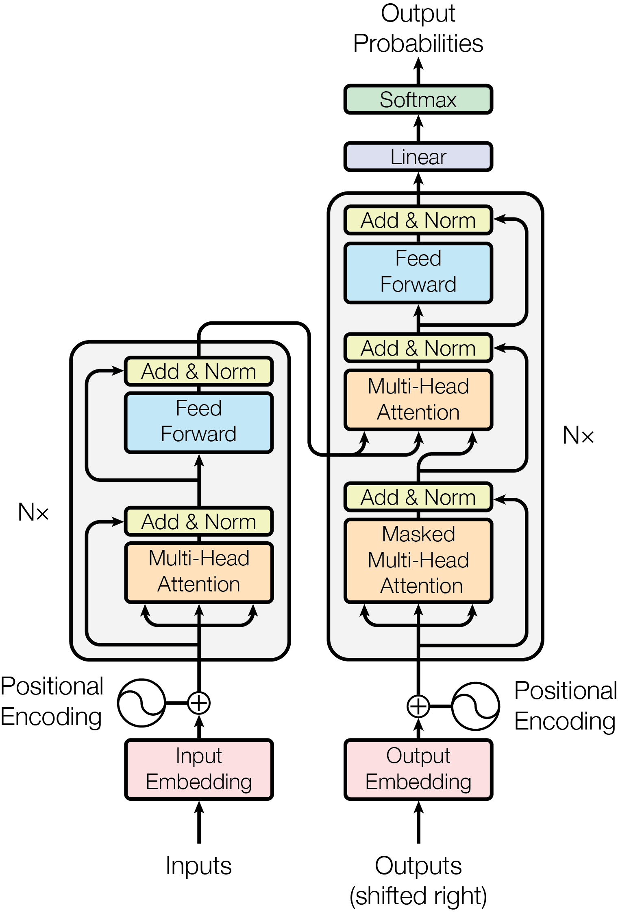
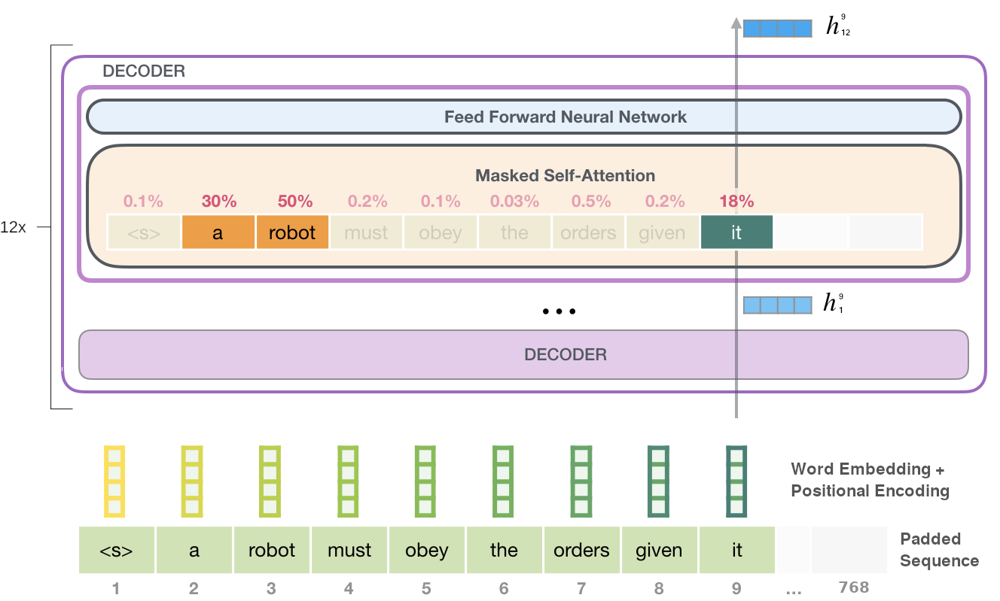
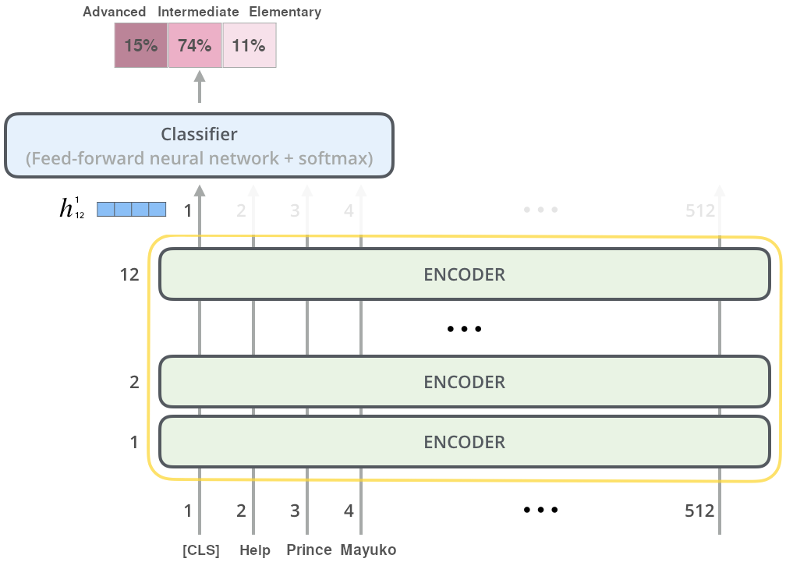
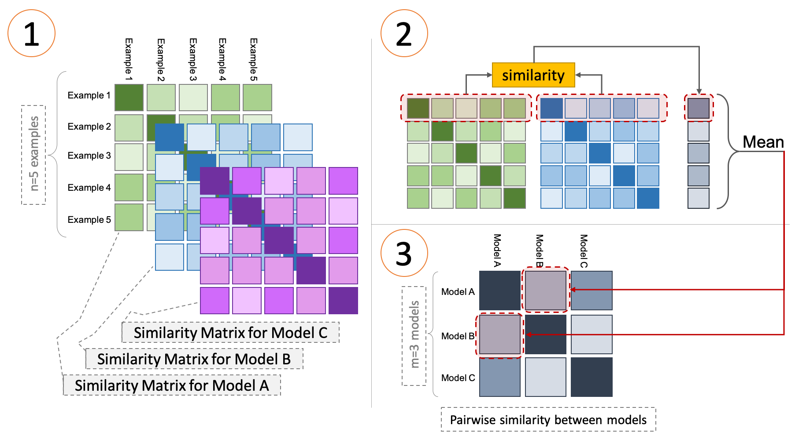

---
output:
  bookdown::pdf_document2:
    template: ../templates/brief_template.tex
    pandoc_args: [--wrap=none]
  bookdown::word_document2: default
  bookdown::html_document2: default
documentclass: book
bibliography: ../references.bib
---

```{block type='savequote', quote_author='(ref:box-1976-science)', include=knitr::is_latex_output()}
Now it would be very remarkable if any system existing in the real world could be exactly represented by any simple model. [...] For such a model there is no need to ask the question "Is the model true?". The only question of interest is "Is the model illuminating and useful?".
```
(ref:box-1976-science) --- George @box-1976-science, *Science and Statistics*

<!-- Needed for leaving space to the quote, * is for no indentation after title -->

\titlespacing*{\chapter}{0pt}{80px}{35pt}

# **Models of Linguistic Complexity** {#chap:models}

\minitoc <!-- this will include a mini table of contents-->

\chaptermark{Models of Linguistic Complexity}

Standard linguistic complexity studies analyze complexity annotations produced by human subjects to evaluate how specific language structures influence our perception of complexity under various viewpoints. For example, one can derive insights about early cognitive processing by looking at early gaze metrics, like first pass duration and first fixation duration, or study language comprehension by evaluating perceived complexity annotations. These approaches rely on a single implicit assumption: that *complexity annotations contain enough information to reflect the input's underlying complexity properties* appropriately. Without this premise, there would be a complete disconnect between human subjective perception, as reflected by annotations and linguistic structures. Given the ever-growing compelling evidence derived from carefully-planned complexity research, I argue that this is a relatively safe assumption to be made.

This work instead adopts a modeling-driven approach for the study of linguistic complexity. Annotations produced by human subjects still play a fundamental role in this context. However, instead of acting as the main subject of analysis, they are used as a source of distant supervision to create computational models of linguistic complexity. More specifically, machine learning models are trained to predict complexity annotation from raw input text by minimizing a task-specific loss function. The **learning step** here is fundamental, given the connection mentioned above between linguistic complexity and knowledge acquisition. After the training process, human annotations are put aside, and the model itself is studied as a complexity-sensitive subject: in particular, this study focuses on how the information encoded in the parameters of complexity-trained models is related to structural linguistic properties (Chapter \@ref(chap:ex1)), how this information differs when models are exposed to different complexity perspectives during training (Chapter \@ref(chap:ex2)) and finally how the encoded knowledge affects models' generalization capabilities over unseen constructs (Chapter \@ref(chap:ex3)).

While this approach still relies on the **annotation pertinence assumption** stated above, it requires making a second, stronger hypothesis: that *models employed can grasp a significant portion of the relations subsisting between language structures and complexity perspectives*. This assumption can be further declined in two requirements. First, from a **conceptual** point-of-view, we must ensure that the model architecture is endowed with meaningful inductive biases concerning what is currently known about linguistic complexity. This includes having sufficient approximation capabilities to capture linguistic complexity phenomena, which are likely to be highly-nonlinear functions of the input. From a **functional** perspective, then, we should confirm that the quality of model predictions is sufficiently close to human-produced annotations to make their production mechanisms worth investigating.

This chapter justifies the selected modeling approach and introduces models later employed in complexity assessment experiments. Section \@ref(subchap:desiderata) discusses the conceptual requirements for linguistic complexity modeling and motivates the choice of pretrained **neural language models** as primary subjects of this thesis work. Section \@ref(subchap:nlm) presents the architectures used in experimental sections and their desirable properties regarding the encoding of linguistic structures in latent representations. Finally, Section \@ref(subchap:analyzing-nlm) presents the challenge of interpreting NLM's representations and behaviors and introduces various interpretability approaches used throughout this study.

## Desiderata for Models of Linguistic Complexity {#subchap:desiderata}

From the in-depth analysis of Chapter \@ref(chap:ling-comp), we can distill some general desiderata for an idealized LCA model $M^*$. From a linguistic perspective:

- $M^*$ *should distinguish between lexical forms and be informed about their probability of occurrence.* This is a basic (although fundamental) step given the importance of words' variety and frequency in determining our perception of complexity.

- $M^*$ *should be aware of syntactic structures and sensitive to their properties.* As we saw with garden-path sentences, atypical or ambiguous syntax constructs are among the most prominent factors for determining the magnitude of processing difficulties. An ideal model should map complex syntactic constructs to higher complexity scores and discriminate potentially ambiguous or problematic structures from regular ones, even when changes in the form are minimal (e.g., when a single comma is missing).

- $M^*$ *should capture semantic information and relations between entities.* Ideally, this means the ability to frame agents, patients, and actions in a semantic context and evaluate how likely or typical the latter is. For example, semantically unrelated entities occurring together in a sentence should produce an increase in processing difficulties. This includes the ability to disambiguate polysemic terms (e.g., "fly" verb vs. noun) given the surrounding context.

Then, from a technical standpoint:

- $M^*$ *should not rely on hand-crafted features to represent language*. This is an implicit requirement since this study aims to analyze how the model autonomously learns to represent language in its parameters while simultaneously encoding information about its complexity. Chapter \@ref(chap:ex1) presents how complexity models with hand-crafted features compare to those selected for the study.

- $M^*$ *should not rely too heavily on labeled data.* Complexity datasets presented in Chapter \@ref(chap:ling-comp) are usually composed of a few thousand labeled examples. While this may seem a lot to our eyes, a language model may require a lot more information to achieve sufficient generalization capabilities. A viable option in this context, as we will see with NLMs, is to prime models with general linguistic knowledge through an unsupervised pretraining procedure before training them on complexity-related tasks.

- $M^*$ *should be sufficiently interpretable.* Ideally, we would like to draw direct causal relations from input properties to complexity prediction in a consistent way across complexity perspectives. More realistically, we need at least to find coherent patterns between the model's inputs and its predictive behaviors.

Most standard modeling approaches fail to encompass even a small subset of those non-trivial requirements. For example, one can consider modeling complexity properties with static word representations [@turian-etal-2010-word] such as Word2Vec or GloVe embeddings [@mikolov-etal-2013-efficient; @pennington-etal-2014-glove]. In these approaches, feature vectors representing words are learned by a neural network through a pretraining procedure to model word co-occurrences. While these approaches were shown to capture a significant amount of semantic information while reducing the dependence on labeled data thanks to pretraining, static word embeddings generally yield modest results when employed for syntactic predictions [@andreas-klein-2014-much]. Moreover, since the model learns a direct mapping $f: t_i \rightarrow \textbf{v}_i$ from lexical forms to vectorial representations, polysemic terms are reduced to single context-independent representation, and contextual information that often plays a crucial role in determining complexity is mixed and diluted.

Among more sophisticated modeling approaches for representing language, I argue that modern **neural language models** (NLMs) are the approaches that yield a better match for the requirements stated above. These models consist of multi-layer neural networks [@goodfellow-etal-2016-deep] pretrained using standard language modeling or masked language modeling training objectives to produce **contextualized word embeddings**, which were shown to be very effective in downstream syntactic and semantic tasks [@peters-etal-2018-deep] even with relatively few labeled examples. Moreover, being language models, NLMs predict a probability distribution over their vocabulary at each step, enabling us to compute information-theoretic metrics such as surprisal that we saw being conceptually close to one-stage cognitive processing accounts. Finally, their high parameter counts and the presence of self-attention mechanisms [@bahdanau-etal-2015-neural; @vaswani-etal-2017-attention] as learned weighting functions suggests that NLMs might be capable of learning to approximate highly nonlinear functions effectively.

The most significant downside of NLMs in the context of our analysis is their opaqueness. As for most neural networks, the nonlinear multi-layer structure that characterizes NLMs makes them incredibly valid function approximators. At the same time, though, it hinders our efforts in interpreting their behaviors [@samek-etal-2019-explainable]. Because of this fact, in recent years, we witnessed a surge in approaches trying to "open the black box" of neural networks by using various techniques borrowed from information theory [@shwartz-tishby-2017-opening] and cognitive science [@kriegeskorte-etal-2008-representational]. Given the wide availability of these approaches, this work joins the choir of interpretability researchers and argues that studying how such performant models encode their knowledge about language complexity is still a matter of interest and worth exploring. In the next section, the architecture and training process of NLMs will be formalized, and their properties will be described in detail.

## Neural Language Models: Unsupervised Multitask Learners {#subchap:nlm}

The objective of natural language processing applications such as *summarization*, *machine translation*, and *dialogue generation* is to produce text that is both **fluent** and contextually accurate. As we saw in Chapter \@ref(chap:ling-comp), a text's fluency can also be used as a significant factor in determining its complexity from a linguistic viewpoint. A possible approach to establishing a sentence's fluency is to rely on **relative frequency estimates** for words in large corpora. Consider a sentence $s$ and a large corpus $\mathcal{C}$. We can estimate its probability of occurrence in natural language as:

\begin{equation}
P(s) = \frac{\text{count}(s)}{|\mathcal{C}|}
\end{equation}

While this is an unbiased estimator since it converges to the actual frequency value when the corpus size is sufficiently large, it is both very data-reliant and highly unreliable. If a sentence happens to be absent in $\mathcal{C}$, it will be assigned probability equal to zero. Therefore, we need to rely on other approaches, such as language models, to obtain reliable estimates from limited training datasets.

As we saw in Chapter \@ref(subsubchap:lm-surprisal), language models assign probabilities to sequences of tokens. Formally, this can be framed as learning words' conditional probability distributions given their context, either *preceding* or *bidirectional* depending on the language modeling approach. I will here refer to sequential language models unless otherwise mentioned.

Language models are trained on sequences $\textbf{x} = \langle x_1, \dots, x_n \rangle$ composed by $n$ tokens taken from a predefined vocabulary $\mathcal{V}$. Each token $x_i$ can be represented as a one-hot encoded vector $x_i \in \{0,1\}^{|\mathcal{V}|}$, and the probability of sequence $\textbf{x}$ is factored using the chain rule:

\begin{equation}
P(\textbf{x}) = \prod_{t=1}^{n}\,P(x_t\,|\,x_1,\dots,x_{t-1})
\end{equation}

After the training process, we can use the likelihood that the model assigns to **held-out data** $\textbf{y}$ treated as a single stream of $m$ tokens as an intrinsic evaluation metric for the quality of its predictions:

\begin{equation}
\ell(\textbf{y}) = \sum_{t=1}^m \log P(x_t|x_1,\dots,x_{t-1})
\end{equation}

$\ell(\textbf{y})$ can be rephrased in terms of **perplexity**, an information-theoretic metric independent from the size of the held-out set:

\begin{equation}
\text{PPL}(\textbf{y}) = 2^{-\ell(\textbf{y})/m}
\end{equation}

$\text{PPL}$ is equal to 1 if the language model is perfect (i.e., predicts all tokens in the held-out corpus with probability 1) and matches the vocabulary size $|\mathcal{V}|$ when the model assign a uniform probability to all tokens in the vocabulary (a "random" language model):

\begin{align} 
\log_2(\textbf{y}) = \sum_{t=1}^m \log_2 \frac{1}{|\mathcal{V}|} = - \sum_{t=1}^m \log_2 |\mathcal{V}| = -m \log_2 |\mathcal{V}| \\
\text{PPL}(\textbf{y}) = 2^{\frac{1}{m}m\log_2 |\mathcal{V}|} = 2^{\log_2 |\mathcal{V}|} = |\mathcal{V}|
\end{align} 

Perplexity represents the number of bits required to encode the average word in the corpora. For example, reporting a perplexity score of 10 over a held-out corpus means that the language model will predict on average words with the same accuracy as if it had to choose uniformly and independently across ten possibilities for each word.

While tokens used by language models generally correspond to words in most NLP pipelines, recent language modeling work highlighted the effectiveness of using subword tokens [@sennrich-etal-2016-neural; @wu-etal-2016-google; @kudo-richardson-2018-sentencepiece] or even single characters to further improve LM's generalization performances. In particular, models used in this work rely on SentencePiece and Byte-Pair Encoding (BPE) subword tokenization [@sennrich-etal-2016-neural; @kudo-richardson-2018-sentencepiece]. The SentencePiece algorithm derives a fixed-size vocabulary from word co-occurrences in a large corpus and treats whitespace as a normal symbol by converting it to "**\_**", while BPE does the same using the "Ġ" character. For example:

> **Input sentence:** Heteroscedasticity is hard to model!

> **SentencePiece tokenization:** **\_**Hetero   s   ced   astic   ity   **\_**is   **\_**hard   **\_**to   **\_**model   !

> **BPE tokenization:** H   eter   os   ced   astic   ity   Ġis   Ġhard   Ġto   Ġmodel   !


where whitespaces correspond to separators after tokenization. From the example, we can observe that frequent words like *hard*, *to* and *model* are treated similarly by both tokenizers, while rare words like *heteroscedasticity* are split into subwords depending on their observed frequency inside the tokenizer's training corpus.

In recent years n-gram language models, which were the most common approach to estimate probabilities from relative frequencies, have been largely supplanted by neural networks. A significant advantage of neural approaches is the overcoming of context restrictions: relevant information can be incorporated from arbitrarily distant contexts while preserving the tractability of the problem from both a statistical and a computational viewpoint.

Neural language models treat language modeling as a *discriminative* learning task aimed at  maximizing the log conditional probability of a corpus. Formally, the probability distribution $p(x|c)$ is reparametrized as the dot product of two dense numeric vectors $\boldsymbol\theta_x, \boldsymbol h_c \in \mathbb{R}^H$ under a softmax transformation:

\begin{equation}
P(x|c) = \frac{\exp(\boldsymbol\theta_x \cdot \boldsymbol h_c)}{\sum_{x'\in\mathcal{V}} \exp(\boldsymbol\theta_{x'} \cdot \boldsymbol h_c)}
(\#eq:softmax-lm)
\end{equation}

In \@ref(eq:softmax-lm), the denominator is present to ensure that the probability distribution is properly normalized over vocabulary $\mathcal{V}$. $\boldsymbol\theta_x$ represent model parameters that can be learned through an iterative procedure, while $\boldsymbol h_c$ is the contextual information that can be computed in different ways depending on the model. For example, a neural language model based on the **recurrent neural network** architecture (RNN; @mikolov-etal-2010-recurrent) recurrently updates context vectors initialized at random with relevant information that needs to be preserved while moving through the sequence.^[Refer to Chapter 6.3 of @eisenstein-2019-introduction for additional details about recurrent language models.]

This work leverages models belonging to the most recent and influential family of neural language models at the time of writing, that is, the one based on the **Transformer** architecture [@vaswani-etal-2017-attention]. Transformers are deep learning models designed to handle sequential data and were conceived to compensate for a significant downside of recurrent models: the need to process data in an orderly manner to perform backpropagation through time. By replacing recurrent computations with attention mechanisms to maintain contextual information throughout the model, Transformers' operations are entirely parallelizable on dedicated hardware and *therefore lead to reduced training times*. This fact is especially relevant considering the massive corpora size used to pretrain neural language models to obtain contextual representations. **Self-attention** was also shown to behave better than other approaches at learning long-range dependencies, avoiding the *vanishing gradient* problem that plagued non-gated recurrent NLMs altogether [@pascanu-etal-2013-difficulty].

(ref:transformer-caption) The original Transformer model architecture by @vaswani-etal-2017-attention.

```{r out.width = "50%", fig.align='center', fig.cap="(ref:transformer-caption)", label="transformer", echo=FALSE}

```

The original Transformer architecture comprises an encoder and a decoder, each composed of a stacked sequence of identical layers that transform input embeddings in outputs with the same dimension (hence the name). First, the encoder maps the sequence $(x_1, \dots, x_n)$ to a sequence of embeddings $\boldsymbol z = (z_1, \dots, z_n)$. Given $\boldsymbol z$, the decoder then autoregressively produces an output token sequence $(y_1, \dots, y_m)$. Each layer of the Transformer encoder comprises two sublayers, a **multi-head self-attention mechanism** and a **feed-forward network**, surrounded by residual connections and followed by layer normalization. The decoder includes a third layer that performs multi-head self-attention over the encoder output and modifies the original self-attention sublayer to prevent attending to future context, as required by the language modeling objective. Figure \@ref(fig:transformer) presents the original architecture for a $N$-layer Transformer. I will now proceed to describe the main components of the Transformer model.

[Positional Encodings]{.custompar} The original Transformer relies on two sets of embeddings to represent the input sequence: learned **word embeddings**, used as vector representations for each token in the vocabulary, and fixed **positional encodings** (PEs) used to inject information about the position of tokens in the sequence. Those are needed since no information about the sequential nature of the input would otherwise be preserved. For position $pos$ and dimension $i$, PEs correspond to sinusoidal periodic functions that were empirically shown to perform on par with learned embeddings, and were chosen to enable extrapolation for longer sequences:

\begin{align} 
PE_{pos, 2i} = \sin(\text{pos}/10000^{2i/|h|}) \\
PE_{pos, 2i + 1} = \cos(\text{pos}/10000^{2i/|h|})
\end{align}

where $|h|$ is the model's hidden layer size. Embeddings and PEs are summed and passed to the attention layer.

[Self-Attention]{.custompar} The *scaled dot-product self-attention* mechanisms is the driving force of the Transformer architecture. Given an input embedding matrix $X$, we multiply it by three weight matrices $W^Q, W^K, W^V$ obtaining the projections $Q$ (**queries**), $K$ (**keys**) and $V$ (**values**). Those are then combined by the self-attention function as follows:

\begin{equation}
\text{Attention(Q,K,V)} = \text{softmax}\Big ( \frac{QK^T}{\sqrt{d_k}}\Big)V
\end{equation}

where $d_k$ is the size of individual query and key vectors. The output of this operation is a matrix $Z$ which will be passed to the feed-forward layer. The self attention mechanism is further extended to **multi-head self-attention** in Transformer architectures. In the multi-head variant, the attention function is applied in parallel to $n$ version of queries, keys and values projected with learned parameter matrices, and outputs are finally concatenated and projected again to obtain final values:

\begin{align}
\text{MultiHead}(Q,K,V) = \text{Concat}(\text{head}_1,\dots, \text{head}_n)W^O \\
\text{where } \text{head}_i = \text{Attention}(QW_i^Q,KW_i^K,VW_i^V)
\end{align}

Where $W_i^Q \in \mathbb{R}^{|h| \times d_k}$, $W_i^K \in \mathbb{R}^{|h| \times d_k}$, $W_i^V \in \mathbb{R}^{|h| \times d_v}$ and $W^O \in \mathbb{R}^{nd_v \times |h|}$. In multi-head attention layers of Figure \@ref(fig:transformer), each position can attend to all position from the previous layer, while in the **masked multi-head attention** layer only previous positions in the sequence can be attended by applying a triangular mask to attention matrices. This additional step is needed to preserve the autoregressive property during decoding.

[Feed-forward Layer]{.custompar} Each block in the encoder and the decoder contains an independent fully connected 2-layer feed-forward network with a ReLU nonlinearity applied separately to each position of the sequence:

\begin{equation}
\text{FFN}(Z) = \max(0,Z\,\Theta_1 + b_1)\Theta_2 + b_2
\end{equation}

where $Z$ are the representations passed forward from the attention sublayer, $\Theta_1, \Theta_2$ are two learned independent parameter matrices for each layer and $b_1, b_2$ are their respective bias vectors.

Now that the main concepts regarding the Transformer architecture have been introduced, the two Transformer-based models used in this study will be presented.

[GPT-2]{.custompar} GPT-2 [@radford-etal-2019-language] is a transformer model built using only the decoder blocks with masked self-attention, alongside BPE tokenization. The latter's autoregressive capabilities, i.e. being able to iteratively add a newly predicted token to the existing sequence in the next steps, make it especially suitable for text generation and related tasks. The learning of model parameters is performed in two stages. First, an **unsupervised pretraining** is carried out to learn a high capacity language model on a large corpus: in particular, here the model is trained to maximize the likelihood of sequential language modeling over **WebText**, a corpus containing roughly 8 million documents (40GB of text), by adapting its parameters using stochastic gradient descent. The purpose of this step is to learn contextual word embeddings encoding both low and high-level information that can be recycled in downstream tasks, following the **transfer learning** approach inspired by the field of computer vision and initially proposed by @howard-ruder-2018-universal for NLP. The second step is a **supervised fine-tuning**, where the language modeling softmax layer is replaced by a task-specific layer (called **head**) with parameters $W_y$ receiving final transformer activations $h_l$ and predicting a label $y$ (e.g. in a classification task) as:

\begin{equation}
P(y|x_1,\dots, x_m) = \text{softmax}(h^{sent}_lW_y)
\end{equation}

where $h_l^{sent}$ is the sentence-level representation for $(x_1, \dots, x_m)$. The parameters of the whole model, including transformer blocks and task-specific heads, can then be tuned by minimizing the loss $\mathcal{L}$ over the whole supervised corpus $\mathcal{C}$:

\begin{equation}
\mathcal{L}(\mathcal{C}) = - \sum_{(x,y)} \log P(y|x_1, \dots, x_m) 
\end{equation}

Figure \@ref(fig:gpt2) visualizes the forward pass through the GPT-2 architecture. We see from the figure that attention patterns learned during pre-trained are often interpretable. Here, the token *it* is correctly identified as the pronoun referring to the subject *a robot*. Authors show how large NLMs such as GPT-2 become strong unsupervised multitask learners when trained on sufficiently large corpora, providing the initial motivation for choosing pretrained Transformer models for experiments throughout this study. GPT-2 will be specifically be employed in the experiments of Chapter \@ref(chap:ex3), where its autoregressive nature is ideal for replicating human surprisal estimates during sequential reading on garden-path sentences.

(ref:gpt2-caption) An overview of the forward pass in GPT-2. Adapted from @alammar-2018-illustratedgpt2.

```{r out.width = "100%", fig.align='center', fig.cap='(ref:gpt2-caption)', label="gpt2", echo=FALSE}

```

[ALBERT]{.custompar} ALBERT [@lan-etal-2020-albert] is an efficient variant of the Bidirectional Encoder Representations from Transformers (**BERT**) approach by @devlin-etal-2019-bert. BERT was built following the intuition that many sentence-level tasks would greatly benefit from an approach capable of incorporating bidirectional context inside language representations. This is not the case for decoder-based approaches like GPT-2 that, being aimed at generation-oriented tasks, could only leverage the previous context using masked self-attention. BERT tackles the unidirectional constraint by introducing **masked language modeling** (MLM, see Equation \@ref(eq:sent-surprisal-cases)) and using a stack of transformer encoder layers with GELU nonlinearities [@hendrycks-gimpel-2016-gaussian]. 

As for GPT-2, the pretraining and fine-tuning steps are taken to provide the model with general language knowledge and subsequently adapt it to specific downstream tasks. At each pretraining step, a fixed portion of input tokens get masked, and the model predicts the original vocabulary id of masked tokens. Moreover, a sentence-level task is used to improve discourse coherence. For BERT, the **next sentence prediction** (NSP) task is adopted, i.e. determining whether, given two sentences, they are consecutive or not in the original text using both positive and negative pairs. NSP was found unreliable by subsequent studies and was replaced in ALBERT by a **sentence ordering prediction** loss that is more challenging for the model. A third set of **segment embeddings** is added to initial representations to distinguish input sentences in multi-sentence tasks. Special tokens `[CLS]` and `[SEP]` are added as sentence-level representations.

ALBERT introduces two main contributions aimed at reducing the final number of model parameters inside BERT:

- **Factorized embedding parametrization**: a projection layer is introduced between the embedding matrix $E$ and the hidden layer $H$ of the model so that the dimensions of the two are untied. This approach modifies embedding parameter count from $O(|V| \times |E|)$ to $O(|\mathcal{V}| \times |E| + |E| \times |h|)$, with $|\mathcal{V}|, |E|, |h|$ being respectively the sizes of vocabulary, embedding vectors and hidden layers. A significant reduction in model parameters is therefore produce when $|h| \gg |E|$, which is desirable since $H$ contains *context-dependent representations* that encode more information than the *context-independent* ones of $E$.

- **Cross-layer parameter sharing**: All layers of ALBERT share the same set of feed-forward and self-attention parameters. Therefore, we can see ALBERT as an iterated function $f_A^n: h \rightarrow h'$, where $n$ is the number of encoder layers present in the model (in this study $n=12$), with parameters trained using end-to-end stochastic gradient descent.

Both factors significantly contribute to reducing the computational complexity of the model without affecting too much its performances: the ALBERT base used in all experimental chapters of this study have 9x fewer parameters than a regular BERT base model (12M vs. 108M) while performing comparably well on many natural language understanding benchmarks such as GLUE [@wang-etal-2018-glue] and SQuAD [@rajpurkar-etal-2016-squad].

Figure \@ref(fig:albert) presents how a pretrained ALBERT model can be leveraged for sentence classification, using the ARA task as an example. We note that the procedure is the same as for GPT-2: a task-specific classification head is initialized with random weights, and the whole model-head architecture is fine-tuned on the target task end-to-end. The figure also shows how the common choice for BERT-based models is to use their `[CLS]` token $h_{12}^{1}$ as the full-sentence representation equivalent $h_{12}^{sent}$.

(ref:albert-caption) Using a pretrained ALBERT model for the ARA task. Adapted from @alammar-2018-illustratedbert.

```{r out.width = "85%", fig.align='center', fig.cap='(ref:albert-caption)', label="albert", echo=FALSE}

```

To conclude, the fine-tuning approach relying on a pretrained model "body" and a task-specific head adopted in both GPT-2 and ALBERT can be extended out-of-the-box to a **multitask learning** scenario. A multitask approach can prove useful when considering parallel annotations on the same corpus that provide similar but complementary information about a studied phenomenon's nature. We can interpret this as an inductive bias that encourages finding knowledge representations to explain multiple sets of annotations at once.^[See @ruder-2017-overview for a comprehensive overview] More specifically, multitask learning with **hard parameter sharing** [@caruana-1997-multitask] is performed in all experimental sections over eye-tracking scores to produce representations encompassing the whole set of phenomena related to natural reading. For doing so, each metric was associated with a task-specific head, and the whole set of heads was trained while sharing the same underlying model.

### Emergent Linguistic Structures in Neural Language Models {#subsubchap:syntax-nlm}

This section presents evidence in support of the ability of pretrained language models to effectively encode language-related properties in their learned representations.^[@rogers-etal-2020-primer and @linzen-baroni-2021-syntactic are surveys covering this topic.]

@lin-etal-2019-open were among the first to highlight how BERT representations encode hierarchical structures akin to syntax trees, despite the absence of syntactic information or recurrent biases during pretraining. @liu-etal-2019-linguistic and @tenney-etal-2019-bert further showed that contextualized embeddings produced by BERT encode information about part-of-speech, entity roles, and partial syntactic structures.

@hewitt-manning-2019-structural formulate the **syntax distance hypothesis**, assuming that there exists a linear transformation $B$ of the word representation space under which vector distance encodes parse trees. They proceed to test this assumption equating L2 distance in the 2-dimensional space of representations projected by $B \in \mathbb{R}^{2 \times |h|}$ and tree distances in parse trees, finding a close match between BERT representational space and Penn Treebank formalisms. The approach is visualized in Figure \@ref(fig:struct-probe). @jawahar-etal-2019-bert work support these findings, highlighting a close match between BERT representation and dependency trees after testing multiple decomposition schemes. The syntax distance hypothesis's validity is especially relevant to this work, given the aforementioned importance of syntactic properties in driving human subjects' perception of complexity.

(ref:struct-probe-caption) The mapping from 2D representation space to syntax tree distances adopted in @hewitt-manning-2019-structural.

```{r out.width = "85%", fig.align='center', fig.cap='(ref:struct-probe-caption)', label="struct-probe", echo=FALSE}
include_graphics('figures/2_struct_probe.png')
```

Despite the evidence of syntactic knowledge in contextual word representations, recent results suggest that the model may not leverage this for its predictions. @ettinger-2020-bert highlights the insensitivity of BERT to negation and malformed inputs using psycholinguistic diagnostics commonly used with human subjects, while @wallace-etal-2019-nlp show that nonsensical inputs do not affect the prediction quality of BERT, despite having a clear input on underlying syntactic structures. These results are coherent with the experimental findings of this study and will be further discussed in later sections.

## Analyzing Neural Models of Complexity {#subchap:analyzing-nlm}

Having introduced the model architectures that will be used throughout this study, we will now focus on the interpretability approaches allowing us to analyze and compare neural network representations.

When training deep neural networks, we would like to go beyond predictive performance and understand how different design choices and training objectives affect learned representations from a qualitative viewpoint. This fact is especially crucial in the model-driven approach adopted in this work, as stated at the end of Section \@ref(subchap:desiderata). While for linear models, the direct correspondence between the magnitude of feature coefficients and feature importance provides us with some out-of-the-box insights about decision boundaries and feature importance, the hierarchical and nonlinear structure that characterizes neural networks produce model weights that are relatively uninformative when taken in isolation.

This work focuses on two interpretability perspectives: highlighting linguistic knowledge encoded in model representations (Chapter \@ref(chap:ex1)) and comparing representations across models trained on different complexity-related tasks (Chapter \@ref(chap:ex2)). For the first objective, *probing classifiers*, which have become the de-facto standard in the interpretability literature, are used to evaluate the amount of information encoded in each layer of the model.^[See @belinkov-glass-2019-analysis survey and @belinkov-etal-2020-interpretability tutorial.] In the second case, two multivariate statistical analysis methods, namely *representational similarity analysis* and *canonical correlation analysis*, are leveraged to quantify the relation between model embeddings by evaluating their second-order similarity and learning a mapping to a shared low-dimensional space, respectively. The following sections conclude the chapter by presenting the three approaches in detail.

### Probing classifiers {#subsubchap:probe}

The **probing task approach** is a natural way to estimate the mutual information shared by a neural network's parameters and some latent property that the model could have implicitly learned during training. During probing experiments, a supervised model (*probe*) is trained to predict the latent information from the network's learned representations. If the probe does well, we may conclude that the network effectively encodes some knowledge related to the selected property. 

Formally speaking, let $f: x_i \rightarrow y_i$ be a neural network model mapping a corpus of input sentences $X = (x_1, \dots, x_n)$ to a set of outputs $Y = (y_1, \dots, y_n)$. Assume that each sentence $x_i$ is also labeled with some linguistic annotations $z_i$, reflecting the underlying properties we aim to detect.  Let also $h_l(x_i)$ be the network's output at the $l$-th layer given the sentence $x_i$ as input. To estimate the quality of representations $h_l$ with respect to property $z$, a supervised model $g: h_l(x_i) \rightarrow z_i$ mapping representations to property values is trained. We take such model's performances as a proxy of $H(h_l(x),z)$. In information theoretic terms, the probe is trained to minimize entropy $H(z|h_l(x))$, and by doing that it maximizes mutual information between the two quantities.

The probe $g$ does not need to be a linear model. While historically simple linear probes were used to minimize the risk of memorization, recent results show that more complex probes produce tighter estimates for the actual underlying information [@pimentel-etal-2020-information]. To account for the probe's ability to learn the task through sheer memorization, @hewitt-liang-2019-designing introduce *control tasks* using the performances of a probe exposed to random labels as baselines.

@alain-bengio-2016-understanding were among the first to use linear probing classifiers as tools to evaluate the presence of task-specific information inside neural networks' layers. The approach was later extended to the field of NLP by @conneau-etal-2018-cram and @zhang-bowman-2018-language *inter alia*, which evaluated the presence of semantic and syntactic information inside sentence embeddings generated by LSTM encoders [@hochreiter-1997-long] pretrained on different objectives using probing task suites. Recently, @miaschi-dellorletta-2020-contextual showed how contextual representations produced by pretrained Transformer models could encode sentence-level properties within single-word embeddings. Moreover, @miaschi-etal-2020-linguistic highlighted the tendency of pretrained NLMs to lose general linguistic information during the fine-tuning process and found a positive relation between encoded linguistic information and the downstream performances of the model.

### Representational Similarity Analysis {#subsubchap:rsa}

(ref:rsa-caption) The Representational Similarity Analysis (RSA) algorithm applied to the representations of three models. Image taken from @abnar-2020-visualization.

```{r out.width = "100%", fig.align='center', fig.cap='(ref:rsa-caption)', label="rsa", echo=FALSE}

```

**Representational similarity analysis** (RSA, @laakso-2000-content) is a technique developed in the field of cognitive science to evaluate the similarity of fMRI responses in selected regions of the brain after a stimulus [@kriegeskorte-etal-2008-representational]. The technique can be extended to compare the heterogeneous representational spaces formed by a set of computational models $m$ exposed to a shared set of observations. Figure \@ref(fig:rsa) visualizes the approach. First, each model is fed with a shared corpus of $n$ sentences to produce a set of matrix embeddings $(E^1, \dots, E^m)$, where $E^i_j$ represents the embedding produced by the last layer of the $i$-th model on the $j$-th sentence of the corpus.^[This can be any layer; embeddings can be produced by different layers of the same model.] Next, for each matrix $E^i$ a representational distance matrix $S^i$ is produced such that $S^i_{j,k} = \text{sim}(E^i_j, E^i_k),\;S^i \in \mathbb{R}^{n \times n}$ where $\text{sim}_1$ is a similarity function (here, *dot product*). $S_i$ encodes information on the similarity subsisting between model activations across different observations. Finally, a second-level *representational similarity matrix* $S'$ is computed, where for each pair of matrices $(S^i, S^j)$ the corresponding $S'_{i,j}$ entry has value:

\begin{equation}
S'_{i,j} = S'_{j,i} = \frac{1}{n}\sum_{k=1}^n \text{sim}_2\big(\,\eta\,(S^i_k),\eta\,(S^j_k)\big)
\end{equation}

where $\eta$ is the L1 normalization function and $\text{sim}_2$ is a similarity function (here, *Pearson's correlation coefficient*). Each entry $S'_{i,j}$ corresponds to a similarity score between activity patterns of model $i$ and model $j$ across the entire set of $n$ observations.

In the context of NLP, @abnar-etal-2019-blackbox recently used RSA to compare the activations of multiple neural language models and evaluated the impact of parameter values on the representations formed by a single model. Interestingly, they also use RSA to compare fMRI imaging data collected from human subjects and NLMs activations. @abdou-etal-2019-higher use RSA to highlight the connection between processing difficulties (measured by high gaze metrics values) and the representational divergence, both inter and intra-encoder. @abnar-etal-2020-transferring visualize training paths of various neural network architectures as 2D projections of RSA and show how different inductive biases can be transferred across network categories using knowledge distillation [@hinton-etal-2015-distilling].

### Projection-Weighted Canonical Correlation Analysis {#subsubchap:pwcca}

**Canonical correlation analysis** (CCA, @thompson-1984-canonical) is a statistical technique for relating two sets of observations arising from an underlying unknown process. In the context of this work, the underlying process is represented by NLMs being trained on complexity-related tasks. Given a corpus of sentences $X = (x_1, \dots, x_m)$ annotated with complexity labels, we have that $\boldsymbol z^l_ = (z_i^l(x_1), \dots z_i^l(x_m))$ corresponds to all activations of neuron $z_i$ at layer $l$ stacked to form a vector.^[Different from the activation vector, i.e. all neurons' activations for a single input $(z^l_1(x_1),\dots,z^l_n(x_1))$] If we consider all activations of all neurons in a layer $L_i = (z^i_1, \dots, z^i_n)$ for all inputs, we can represent them as a matrix $A_i \in \mathbb{R}^{m \times n}$, i.e. a set of multidimensional variates where $n$ is the number of neurons in the layer. The CCA algorithm aims to *identify the best* (i.e. most correlated) *linear relationship under mutual orthogonality and norm constraints between two sets of multidimensional variates*, which in this case are activation matrices like $L_1$. This approach was used, among other things, to study the coherence between modeled and real brain activations [@sussillo-etal-2015-neural].

Formally, if we have two activation matrices $A_1, A_2 \in \mathbb{R}^{m \times n}$ we aim to find vectors $w, v \in \mathbb{R}^m$ such that the correlation:

\begin{equation}
\rho = \frac{\langle w^TA_1, v^TA_2 \rangle}{\|w^TA_1\| \cdot \| v^T A_2\|}
\end{equation}

is maximized. The formula can be solved by changing the basis and recurring to singular value decomposition. The output of CCA is a set of singular pairwise orthogonal vectors $u, v$ and their canonical correlation coefficients $\rho \in [0,1]$ representing the correlation of vectors $w^TA_1$ and $v^TA_2$.


(ref:pwcca-caption) Projection-Weighted Canonical Correlation Analysis (PWCCA) applied to last-layer representations of two language models.

```{r out.width = "85%", fig.align='center', fig.cap='(ref:pwcca-caption)', label="pwcca", echo=FALSE}
include_graphics('figures/2_pwcca.png', auto_pdf=TRUE)
```
The SVCCA method [@guyon-etal-2017-svcca] extends the CCA approach for deep learning research by pruning neurons through a singular value decomposition step before computing canonical correlation coefficients. As the authors mention, "This is especially important in neural network representations, where as we will show many low variance directions (neurons) are primarily noise". Then, the similarity between two layers $L_1, L_2$ is computed as the mean correlation coefficient produce by SVCCA, and adapted to a distance measure for evaluation:
\begin{equation}
d_{\text{SVCCA}}(A_1, A_2) = 1 - \frac{1}{|\rho|} \sum_{i=1}^{|\rho|} \rho^{(i)}
\end{equation}
@morcos-etal-2018-insights suggest that the equal importance given to all the $|\rho|$ SVCCA vectors during the final averaging step may be problematic since it has been extensively shown that overparametrized neural networks often do not recur to their full dimensionality for representing solutions [@frankle-carbin-2018-lottery]. They suggest replacing the mean with a weighted mean:
\begin{equation}
d_{\text{PWCCA}}(A_1, A_2) = 1 - \sum_{i=1}^{|\rho|} \alpha \rho^{(i)} \;\;\text{with} \;\; \tilde \alpha_i = \sum_j |\langle h_i, x_j \rangle|
\end{equation}
where weights $\alpha$ corresponds to the portion of inputs $x$ accounted for by CCA vectors $h$ and $\tilde \alpha_i$ values are normalized such that $\sum_i \alpha_i = 1$. The resulting approach, *projection-weighted canonical correlation analysis* (PWCCA), is used in this study and was shown to be much more robust than SVCCA to filter noise in activations. Figure \@ref(fig:pwcca) visualizes the selected approach. 

Notable applications of CCA-related methods in NLP are @saphra-lopez-2019-understanding, where SVCCA is used to study the evolution of LSTM language models' representations during training, and @voita-etal-2019-bottom, where PWCCA is used to compare Transformer language models across layers and pretraining objectives.

\titlespacing{\chapter}{0pt}{0pt}{35pt}