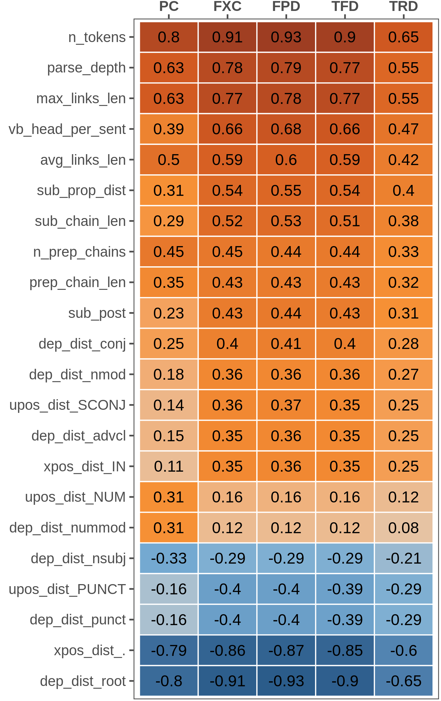
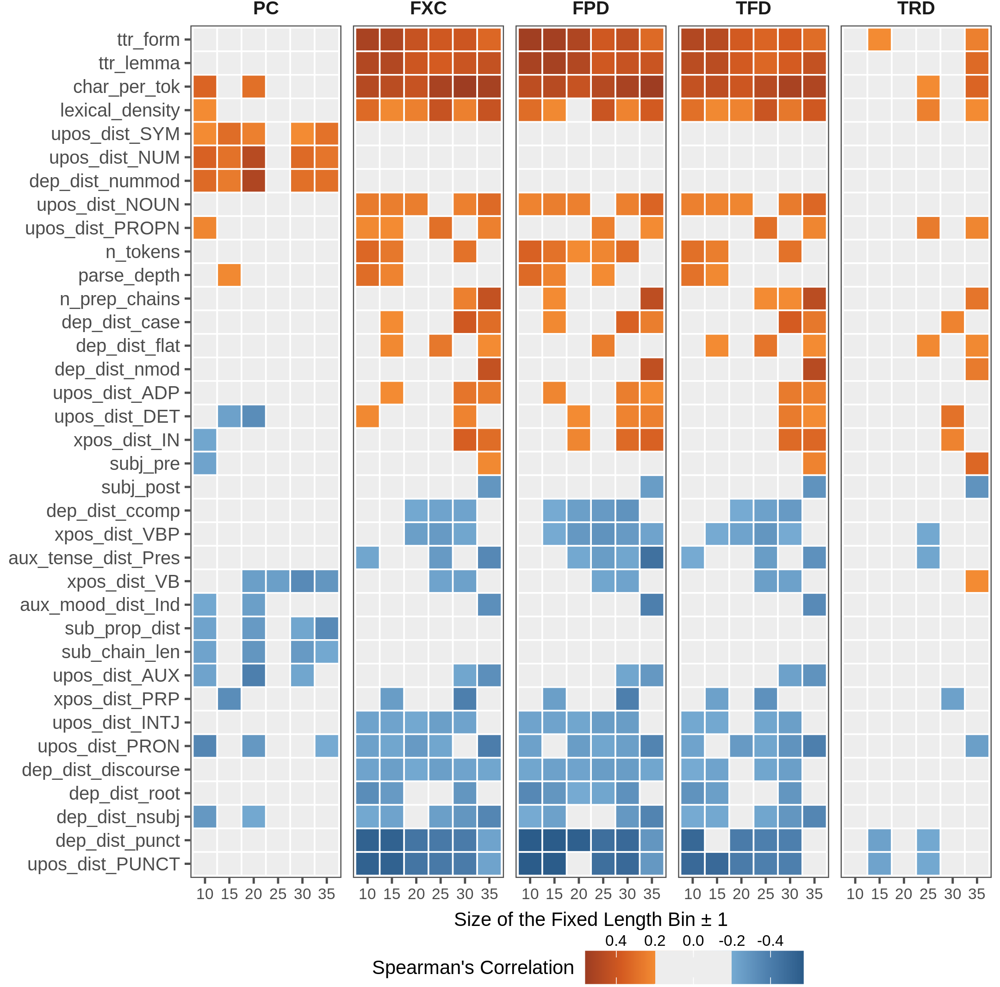
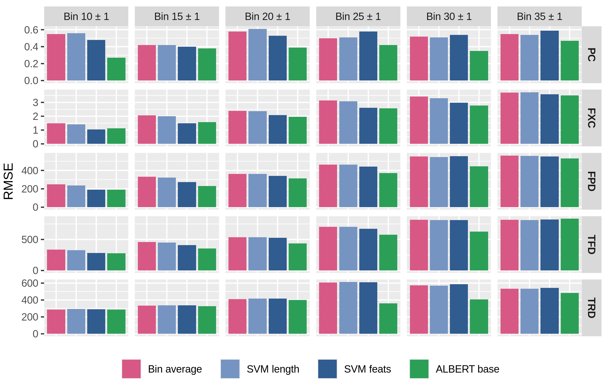

---
output:
  bookdown::pdf_document2:
    template: ../templates/brief_template.tex
  bookdown::word_document2: default
  bookdown::html_document2: default
documentclass: book
bibliography: ../references.bib
---

# **Complexity Phenomena in Linguistic Annotations and Language Models** {#chap:ex1}
\minitoc <!-- this will include a mini table of contents-->

\chaptermark{Complexity Phenomena in Linguistic Annotations and Language Models}

> This chapter investigates the relationship between online gaze metrics and offline perceived complexity judgments by studying how the two viewpoints are represented by a neural language model trained on human-produced data. First, a preliminary analysis of linguistic phenomena associated with the two complexity viewpoints is performed, highlighting similarities and differences across metrics. The effectiveness of a regressor based on explicit linguistic features is then evaluated for sentence complexity prediction and compared to the results obtained by a fine-tuned neural language model with contextual representations. In conclusion, the linguistic competence inside the language model's embeddings is probed before and after fine-tuning, showing how linguistic information encoded in representations changes as the model learns to predict complexity.

Given the conceptual similarity between raw cognitive processing and human perception of complexity, this chapter investigates whether the relation between eye-tracking metrics and complexity judgments can be highlighted empirically in human annotations and language model representations. With this aim, linguistic features associated with various sentence-level structural phenomena are analyzed in terms of their correlation with offline and online complexity metrics. The performance of models using either complexity-related explicit features or contextualized word embeddings is evaluated, focusing mainly on the neural language model ALBERT [@lan-etal-2020-albert] introduced in Section \@ref(subchap:nlm). The results highlight how both explicit features and learned representations obtain comparable performances when predicting complexity scores. Finally, the focus is shifted to studying how complexity-related properties are encoded in the representations of ALBERT.

This perspective goes in the direction of exploiting human processing data to address the interpretability issues of unsupervised language representations [@hollenstein-etal-2019-cognival; @gauthier-levy-2019-linking; @abnar-etal-2019-blackbox], leveraging the *probing task* approach introduced in Section \@ref(subsubchap:probe). It is observed that online and offline complexity fine-tuning produces a consequent increase in probing performances for complexity-related features during probing experiments. This investigation has the specific purpose of studying whether and how learning a new task affects the linguistic properties encoded in pretrained representations. While pre-trained models have been widely studied using probing methods, the effect of fine-tuning on encoded information was seldom investigated. To my best knowledge, no previous work has taken into account sentence complexity assessment as a fine-tuning task for NLMs. Results suggest that the model's abilities during training are interpretable from a linguistic perspective and are possibly related to its predictive capabilities for complexity assessment.

[Contributions]{.custompar} This is the first work displaying the connection between online and offline complexity metrics and studying how a neural language model represents them. This work:

- Provides a comprehensive analysis of linguistic phenomena correlated with eye-tracking data and human perception of complexity, addressing similarities and differences from a linguistically-motivated perspective across metrics and at different levels of granularity; 

- Compares the performance of models using both explicit features and unsupervised contextual representations when predicting online and offline sentence complexity; and 

- Shows the natural emergence of complexity-related linguistic phenomena in the representations of language models trained on complexity metrics.^[Code available at [https://github.com/gsarti/interpreting-complexity](https://github.com/gsarti/interpreting-complexity)]

## Data and Preprocessing {#subchap:ex1-data}

The experiments of this chapter leverage two corpora, each capturing different aspects of linguistic complexity:

[Eye-tracking]{.custompar} For online complexity metrics, only the monolingual English portion of GECO [@cop-etal-2017-presenting], presented in Section \@ref(subsubchap:eye-tracking), was used. Four online metrics spanning multiple phases of cognitive processing are selected, respectively: *first pass duration* (FPD), *total fixation count* (FXC), *total fixation duration* (TFD) and *total regression duration* (TRD) (see Table \@ref(tab:et-metrics) for more details). Metrics are sum-aggregated at sentence-level and averaged across participants to obtain a single label for each metric-sentence pair. As a final step to make the corpus more suitable for linguistic complexity analysis, all utterances with fewer than five words, deemed uninteresting from a cognitive processing perspective, are removed.

[Perceived Complexity]{.custompar} For the offline evaluation of sentence complexity, the English portion of the corpus by @brunato-etal-2018-sentence was used (Section \@ref(subsubchap:pc)). Sentences in the corpus have uniformly-distributed lengths ranging between 10 and 35 tokens. Each sentence is associated with 20 ratings of perceived-complexity on a 1-to-7 point scale. Duplicates and sentences for which less than half of the annotators agreed on a score in the range $\mu_n \pm \sigma_n$, where $\mu_n$ and $\sigma_n$ are respectively the average and standard deviation of all annotators' judgments for sentence $n$ were removed to reduce noise coming from the annotation procedure. Again, scores are averaged across annotators to obtain a single metric for each sentence.

Table \@ref(tab:ex1-stats) presents an overview of the two corpora after preprocessing. The resulting eye-tracking (ET) corpus contains roughly four times more sentences than the perceived complexity (PC) one, with shorter words and sentences on average. The differences in sizes and domains between the two corpora account for multi-genre linguistic phenomena in the following analysis.

```{r echo=FALSE}
ex1_data <- data.frame(
  Rows = c("labels", "domain(s)", "aggregation steps", "filtering steps", "# of sentences", "# of tokens", "avg. sent. length", "avg. token length", "Bin 10±1 size", "Bin 15±1 size", "Bin 20±1 size", "Bin 25±1 size", "Bin 30±1 size", "Bin 35±1 size"),
  PercComp = c("PC", "financial news", "avg. annotators", "filtering by agreement + remove duplicates", 1115, 21723, 19.48, 4.95, 173, 163, 164, 151, 165, 147),
  GECO = c("FPD, FXC, TFD, TRD", "literature", "sentence sum-aggregation + avg. participants", "min. length > 5", 4041, 52131, 12.90, 4.60, 899, 568, 341, 215, 131, 63)
)
ex1_data %>% kable(booktabs=T, caption="Descriptive statistics of the two sentence-level corpora after the preprocessing procedure.", col.names = c("", "Perceived Complexity", "Eye-tracking (GECO)"), label = "ex1-stats", align = c('l', rep('c', times=2)), linesep = "") %>% 
  kable_styling(font_size = 11) %>%
  column_spec(2, width="10em") %>%
  column_spec(3, width="12em") %>%
  row_spec(1, hline_after = T) %>% 
  row_spec(2, hline_after = T) %>% 
  row_spec(3, hline_after = T) %>% 
  row_spec(4, hline_after = T) %>% 
  row_spec(8, hline_after = T) %>%
  pack_rows("Length-binned subsets (# of sentences)", 9, 14) %>%
  row_spec(0, bold=T)
```

## Analysis of Linguistic Phenomena {#subchap:ex1-analysis}

As a first step to investigate the connection between the two complexity paradigms, the correlation of online and offline complexity labels with various linguistic phenomena is evaluated. The Profiling-UD tool [@brunato-etal-2020-profiling] introduced in Section \@ref(subsubchap:structural) is used to annotate each sentence in our corpora and extract from it ~100 features representing their linguistic structure according to the Universal Dependencies formalism [@nivre-etal-2016-universal]. These features capture a comprehensive set of phenomena, from basic information (e.g. sentence and word length) to more complex aspects of sentence structure (e.g. parse tree depth, verb arity), including properties related to sentence complexity at different levels of description. A summary of the most relevant features is presented in Appendix \@ref(app:ling-feats). Features are ranked using their Spearman's correlation score with complexity metrics, and scores are leveraged to highlight the relation between linguistic phenomena and complexity paradigms.

(ref:feat-heatmap-caption) Ranking of the most correlated linguistic features for selected metrics. All of Spearman's correlation coefficients have $p<0.001$.

```{r out.width= "50%", fig.align='center', fig.cap='(ref:feat-heatmap-caption)', label="feat-heatmap", echo=FALSE}

```

The correlation scores analysis highlights how features showing a significant correlation with eye-tracking metrics are twice as many as those correlating with PC scores and generally tend to have higher coefficients, except for the total regression duration (TRD) metric. Nevertheless, the most correlated features are the same across all metrics. Figure \@ref(fig:feat-heatmap) reports correlation scores for features showing a strong connection ($|\rho|>0.3$) with at least one of the evaluated metrics. As expected, sentence length (*n_tokens*) and other related features capturing structural complexity aspects occupy the top positions in the ranking. Among those, we can note the length of dependency links (*max_links_len, avg_links_len*) and the depth of the whole parse tree or selected sub-trees, i.e. nominal chains headed by a preposition (*parse_depth, n_prep_chains*).
Similarly, the distribution of subordinate clauses (*sub_prop_dist, sub_post*) is positively correlated with all metrics but with a more substantial effect for eye-tracking ones, especially in the presence of longer embedded chains (*sub_chain_len*).
Interestingly, the presence of numbers  (*upos_NUM, dep_nummod*) affects only the offline perception of complexity, while it is never strongly correlated with all eye-tracking metrics. This finding is expected since numbers are very short tokens and, like other functional POS, were never found to be strongly correlated with online reading in our results. Conversely, numerical information has been identified as a factor hampering sentence readability and understanding [@rello-etal-2013-one].

### Linguistic Phenomena in Length-controlled Bins {#subsubchap:ex1-analysis-bins}

Unsurprisingly, sentence length is the most correlated predictor for all complexity metrics. Since many linguistic features highlighted in our analysis are strongly related to sentence length, we tested whether they maintain a relevant influence when this parameter is controlled. To this end, Spearman's correlation was computed between features and complexity tasks, but this time considering bins of sentences having approximately the same length. Specifically, we split each corpus into six bins of sentences with 10, 15, 20, 25, 30, and 35 tokens, respectively, with a range of ±1 tokens per bin to select a reasonable number of sentences for our analysis. Resulting subsets have a relatively constant size for the PC corpus, which was constructed ad-hoc to have such uniform length distribution, but have a sharply decreasing size for the eye-tracking corpus (see Table \@ref(tab:ex1-stats), bott. While deemed appropriate in the context of this correlation analysis, the disparity in bin sizes may play a significant role in hampering the performances of models trained on binned linguistic complexity data. This perspective is discussed in Section \@ref(subchap:ex1-modeling).

(ref:feat-bin-heatmap-caption) Rankings of the most correlated linguistic features for metrics within length-binned subsets of the two corpora. Squares show the correlation between features (left axis) and a complexity metric (top) at a specific bin of length (bottom). Coefficients $\geq$ 0.2 or $\leq$ -0.2 are highlighted, and have $p<0.001$.

```{r out.width= "95%", fig.align='center', fig.cap='(ref:feat-bin-heatmap-caption)', label="feat-bin-heatmap", echo=FALSE}

```

Figure \@ref(fig:feat-bin-heatmap) reports the new rankings of the most correlated linguistic features within each bin across complexity metrics ($|\rho| > 0.2$). Again, we observe that features showing a significant correlation with complexity scores are fewer for PC bins than for eye-tracking ones. This fact depends on controlling for sentence length and the small size of bins for the whole dataset. As in the coarse-grained analysis, TRD is the eye-tracking metric less correlated to linguistic features, while the other three (FXC, FPD, TFD) show a homogeneous behavior across bins. For the latter, vocabulary-related features (token-type ratio, average word length, lexical density) are always positive and top-ranked in all bins, especially when considering shorter sentences (i.e. from 10 to 20 tokens). For PC, this is true only for some of them (word length and lexical density). On another note, features encoding numerical information are still highly correlated with the offline perception of complexity in almost all bins.

Interestingly, features modeling subordination phenomena extracted from fixed-length sentences exhibit a reverse trend than when extracted from the whole corpus, i.e. they are negatively correlated with judgments. If, on the one hand, an increase in the presence of subordination for longer sentences (possibly making sentences more convoluted) was expected, on the other hand, when the length is controlled, findings suggest that subordinate structures are not necessarily perceived as a symptom of sentence complexity. 

The analysis also highlights how linguistic features relevant to online and offline complexity are different when controlling for sentence length. This aspect, in particular, was not evident from the previous coarse-grained analysis. Despite blocking sentence length, gaze measures are still significantly connected to length-related phenomena (high correlation with *n_tokens* at various length bins). This observation can be possibly due to the ±1 margin applied for sentence selection and the high sensitivity of behavioral metrics to small input changes.

## Modeling Online and Offline Linguistic Complexity {#subchap:ex1-modeling}

Given the high correlations reported above, the next step involves quantifying the importance of explicit linguistic features from a modeling standpoint. Table \@ref(tab:ex1-results) presents the RMSE and $R^2$ scores of predictions made by baselines and models for the selected complexity metrics. Performances are tested with a 5-fold cross-validation regression with a fixed random seed on each metric. Our baselines use average metric scores of all training sentences (*Avg. score*) and average scores of sentences binned by their length, expressed in number of tokens,  as predictions (*Bin average*). The two linear SVM models leverage explicit linguistic features, using respectively only the *n_tokens* feature (*SVM length*) and the whole set of linguistic features presented above (*SVM feats*). Besides those, the performances of a state-of-the-art Transformer neural language model relying entirely on contextual word embeddings are equally tested. *ALBERT* (@lan-etal-2020-albert; see Section \@ref(subchap:nlm)) as a lightweight yet effective alternative to BERT [@devlin-etal-2019-bert] for obtaining contextual word representations, using its last-layer `[CLS]` sentence embedding as input for a linear regressor during fine-tuning and testing. We selected the last layer representations, despite strong evidence on the importance of intermediate representation in encoding language properties, because we aim to investigate how superficial layers encode complexity-related competence. Given the availability of parallel eye-tracking annotations, we train ALBERT using multitask learning with hard parameter sharing [@caruana-1997-multitask] on gaze metrics.^[Training procedure and parameters are thoroughly described in Appendix \@ref(app:params).]

```{r echo=FALSE, message=FALSE}
library(dplyr)
ex1_results <- data.frame(
  rows = c("Avg. score", "Bin average", "SVM length", "SVM feats", "ALBERT"),
  pcrmse = c(.87, .53, .54, .44, .44),
  pcr2 = c(.00, .62, .62, .74, .75),
  fxcrmse = c(6.17, 2.36, 2.19, 1.77, 1.98),
  fxcr2 = c(.06, .86, .88, .92, .92),
  fpdrmse = c(1078, 374, 343, 287, 302),
  fpdr2 = c(.06, .89, .90, .93, .93),
  tfdrmse = c(1297, 532, 494, 435, 435),
  tfdr2 = c(.06, .85, .86, .92, .90),
  trdrmse = c(540, 403, 405, 400, 382),
  trdr2 = c(.03, .45, .45, .46, .49)
)
ex1_results %>% 
mutate_at(vars(matches("rmse")), function(x) {
  cell_spec(x, bold = x == min(x))
}) %>%
mutate_at(vars(matches("r2")), function(x) {
  cell_spec(x, bold = x == max(x))
}) %>% 
kable(
  booktabs=T, caption="Average Root-Mean-Square Error ($\\sqrt{E^2}$) and $R^2$ score values for sentence-level complexity predictions using 5-fold cross-validation. Lower $\\sqrt{E^2}$ and higher $R^2$ are better.", 
  col.names = c("", rep(c("$\\sqrt{E^2}$", "$R^2$"), times=5)), 
  label = "ex1-results", 
  align = c('l', rep('c', times=10)), 
  linesep = "", 
  escape=FALSE
) %>% 
  kable_styling(font_size = 11) %>%
  column_spec(1, width="10em") %>%
  row_spec(2, hline_after = T) %>% 
  row_spec(4, hline_after = T) %>% 
  add_header_above(c(" ", "PC" = 2, "FXC" = 2, "FPD" = 2, "TFD" = 2, "TRD" = 2), bold=TRUE) %>% 
  pack_rows("Statistical baselines", 1, 2) %>%
  pack_rows("Explicit features", 3, 4) %>%
  pack_rows("Learned representations", 5, 5)
```

From Table \@ref(tab:ex1-results) it can be noted that: 

- The length-binned average baseline is very effective in predicting complexity scores and gaze metrics, which is unsurprising given the extreme correlation between length and complexity metrics presented in Figure \@ref(fig:feat-heatmap);

- The *SVM feats* model shows considerable improvements if compared to the length-only SVM model for all complexity metrics, highlighting how length alone accounts for much but not for the entirety of variance in complexity scores;

- ALBERT performs on-par with the SVM feats model on all complexity metrics despite the small dimension of the fine-tuning corpora and the absence of explicit linguistic information. 

A possible interpretation of ALBERT's strong performances is that the model implicitly develops competence related to phenomena encoded by linguistic features while training on online and offline complexity prediction. We explore this perspective in Section \@ref(subchap:ex1-probing).

### Modeling Complexity in Length-controlled Bins {#subsubchap:ex1-modeling-bins}

(ref:models-bin-scores-caption) Average Root-Mean-Square Error (RMSE) scores for models in Table \@ref(tab:ex1-results), performing 5-fold cross-validation on the length-binned subsets used for Figure \@ref(fig:feat-bin-heatmap). Lower scores are better.

```{r out.width= "100%", fig.align='center', fig.cap='(ref:models-bin-scores-caption)', label="models-bin-scores", echo=FALSE}

```

Similarly to the approach adopted in Section \@ref(subsubchap:ex1-analysis-bins), the performances of models are tested on length-binned data to verify their consistency in the context of length-controlled sequences. Figure \@ref(fig:models-bin-scores) presents RMSE scores averaged with 5-fold cross-validation over the length-binned sentences subsets for all complexity metrics. It can be observed that ALBERT outperforms the SVM with linguistic features on nearly all bins and metrics, showing the largest gains on intermediate bins for PC and gaze durations (FPD, TFD, TRD). Interestingly, models' overall performances follow a length-dependent increasing trend for eye-tracking metrics, but not for PC. This behavior can be possibly explained in terms of the high sensibility to length previously highlighted for online metrics, as well as the broad variability in bin dimensions. It can also be observed how the SVM model based on explicit linguistic features (*SVM feats*) performs poorly on larger bins for all tasks, sometimes being even worse than the bin-average baseline. While this behavior seems surprising given the positive influence of features highlighted in Table \@ref(tab:ex1-results), this phenomenon can be attributed to the small dimension of longer bins, which negatively impacts the generalization capabilities of the regressor. The relatively better scores achieved by ALBERT in those, instead, support the effectiveness of information stored in pretrained language representations when a limited number of examples are available.

## Probing Linguistic Phenomena in ALBERT Representations {#subchap:ex1-probing}

As shown in the previous section, ALBERT performances in complexity predictions are comparable to those of an SVM relying on explicit linguistic features and even better than those when controlling for length. The *probing task* interpretability paradigm (Section \@ref(subsubchap:probe)) is adopted to investigate if ALBERT encodes the linguistic knowledge that we identified as strongly correlated with online and perceived sentence complexity during training and prediction. In particular, the aim of this investigation is two-fold: 

- Probing ALBERT's innate competence in relation to the broad spectrum of linguistic features described in Appendix \@ref(app:ling-feats); and 

- Verifying whether, and in which respect, this competence is affected by a fine-tuning process on the complexity assessment metrics.

Three UD English treebanks spanning different textual genres -- **EWT, GUM, and ParTUT** respectively by @silveira-etal-2014-gold, @zeldes-2017-gum, and @sanguinetti-etal-2015-partut -- were aggregated, obtaining a final corpus of 18,079 sentences with gold linguistic information which was used to conduct probing experiments. The Profiling-UD tool was again leveraged to extract $n$ sentence-level linguistic features $\mathcal{Z}=z_1, \dots, z_n$ from gold linguistic annotations. Representations $A(x)$ were generated for all corpus sentences using the last-layer `[CLS]` embedding of a pretrained ALBERT base model without additional fine-tuning, and $n$ single-layer perceptron regressors $g_i: A(x) \rightarrow z_i$ are trained  to map representations $A(x)$ to each linguistic feature $z_i$. Finally, the error and $R^2$ scores of each $g_i$ were evaluated as proxies for the quality of representations $A(x)$ in encoding their respective linguistic feature $z_i$. The same evaluation is repeated for ALBERTs fine-tuned respectively on perceived complexity labels (PC) and on all eye-tracking labels with multitask learning (ET), averaging scores with 5-fold cross-validation. A selected subset of results is shown on the left side of Table \@ref(tab:probes).

```{r echo=FALSE, message=FALSE}
library(dplyr)
ex1_results <- data.frame(
  rows = c("n\\_tokens", "parse\\_depth", "vb\\_head\\_per\\_sent", "xpos\\_dist\\_.", "avg\\_links\\_len", "max\\_links\\_len", "n\\_prep\\_chains", "sub\\_prop\\_dist", "upos\\_dist\\_PRON", "pos\\_dist\\_NUM", "dep\\_dist\\_nsubj", "char\\_per\\_tok", "prep\\_chain\\_len", "sub\\_chain\\_len", "dep\\_dist\\_punct", "dep\\_dist\\_nmod", "sub\\_post", "dep\\_dist\\_case", "lexical\\_density", "dep\\_dist\\_compound", "dep\\_dist\\_conj", "ttr\\_form", "dep\\_dist\\_det", "dep\\_dist\\_aux", "pos\\_dist\\_VBN", "xpos\\_dist\\_VBZ", "ttr\\_lemma"),
  basermse = c(8.19, 1.47, 1.38, .05, .58, 5.20, .74, .35, .08, .05, .06, .89, .60, .70, .07, .05, .44, .07, .14, .06, .04, .08, .06, .04, .03, .04, .09),
  baser2 = c(.26, .18, .15, .13, .12, .12, .11, .09, .09, .08, .08, .07, .07, .07, .06, .06, .05, .05, .05, .04, .03, .03, .03, .02, .01, .01, .01),
  pcrmse = c(4.66, 1.18, 1.26, .04 , .53 , 4.08, .67 , .33 , .08 , .05 , .06 , .87 , .57 , .67 , .07 , .05 , .46 , .06 , .13 , .06 , .04 , .08 , .06 , .04 , .03 , .04 , .09),
  pcr2 = c(.76, .48, .30, .41, .29, .46, .26, .13, .14, .06, .10, .12, .17, .15, .06, .07, .12, .06, .03, .05, .04, .05, .02, .01, .00, .01, .06),
  etrmse = c(2.87, 1.04, 1.14, .04 , .52 , 3.75, .66 , .31 , .08 , .05 , .06 , .90 , .56 , .62 , .07 , .05 , .44 , .07 , .13 , .06 , .04 , .08 , .06 , .04 , .03 , .04 , .09),
  etr2 = c(.91, .60, .42, .42, .31, .54, .29, .22, .07, .02, .05, .05, .19, .26, .14, .06, .18, .08, .03, .03, .04, .05, .04, .01, .00, .02, .06),
  pc10rmse = c(8.66, 1.50, 1.44, .04 , .59 , 5.24, .72 , .34 , .07 , .05 , .05 , .82 , .59 , .71 , .07 , .05 , .47 , .07 , .13 , .06 , .05 , .08 , .06, .04 , .03 , .04 , .09),
  pc10r2 = c(.18, .16, .09, .18, .10, .11, .14, .05, .23, .16, .17, .22, .12, .04, .06, .09, .05, .07, .13, .10, .02, .05, .03, .06, .01, .02, .04),
  et10rmse = c(6.71, 1.22, 1.30, .04 , .56 , 4.73, .69 , .32 , .08 , .05 , .06 , .86 , .56 , .66 , .07 , .05 , .45 , .07 , .13 , .06 , .04 , .08 , .06 , .04 , .03 , .04 , .09),
  et10r2 = c(.51, .43, .25, .38, .20, .28, .21, .15, .15, .06, .11, .14, .18, .16, .14, .09, .14, .10, .13, .07, .03, .05, .03, .04, .00, .02, .03)
)
ex1_results %>%
mutate(
  across(c(pcr2, etr2, pc10r2, et10r2), 
         ~ cell_spec(., bold = . > baser2 + .07))) %>% 
kable(
  booktabs=T, caption="Root MSE ($\\sqrt{E^2}$) and $R^2$ scores for diagnostic regressors trained on ALBERT representations, respectively, without fine-tuning (Base), with PC and eye-tracking (ET) fine-tuning on all data (left) and on the $10 \\pm 1$ length-binned subset (right). \\textbf{Bold} values highlight relevant increases in $R^2$ from Base.", 
  col.names = c("", rep(c("$\\sqrt{E^2}$", "$R^2$"), times=5)), 
  label = "probes", 
  align = c('l', rep('c', times=10)), 
  linesep = "", 
  escape=FALSE
) %>% 
  kable_styling(font_size = 11) %>%
  column_spec(7, border_right = T) %>%
  add_header_above(c(" ", "Base" = 2, "PC" = 2, "ET" = 2, "PC10±1" = 2, "ET10±1" = 2), bold=TRUE)
```

As it can be observed, ALBERT's last-layer sentence representations have relatively low knowledge of complexity-related probes, but their performances highly increase after fine-tuning. Specifically, a noticeable improvement was obtained on features that were already better encoded in base pretrained representation, i.e. sentence length and related, suggesting that fine-tuning possibly accentuates only properties already well-known by the model, regardless of the target task. To verify that this isn't the case, the same probing tests were repeated on ALBERT models fine-tuned on the smallest length-binned subset (i.e. $10\pm1$ tokens) presented in previous sections. The right side of Table \@ref(tab:probes) presents the resulting scores. From the length-binned correlation analysis of Section \@ref(fig:feat-bin-heatmap), PC scores were observed to be mostly uncorrelated with length phenomena, while ET scores remain significantly affected despite our controlling of sequence size. This observation also holds for length-binned probing task results, where the PC model seems to neglect length-related properties in favor of task-specific ones that were also highlighted in our fine-grained correlation analysis (e.g. word length, numbers, explicit subjects). The ET-trained model follows the same behavior, retaining strong but lower performances for length-related features.

In conclusion, although higher probing task performances after fine-tuning are not direct proof that the neural language model exploits newly-acquired morpho-syntactic and syntactic information, results suggest that training on tasks strongly connected with underlying linguistic structures triggers a change in model representations resulting in a better encoding of related linguistic properties.

## Summary {#subchap:ex1-summary}

In this chapter, the connection between eye-tracking metrics and the offline perception of sentence complexity was investigated from an experimental standpoint. An in-depth correlation analysis was performed between complexity scores and sentence linguistic properties at different granularity levels, highlighting the strong relationship between metrics and length-affine properties and revealing different behaviors when controlling for sentence length. Models using explicit linguistic features and unsupervised word embeddings were evaluated on complexity prediction, showing comparable performances across metrics. Finally, the encoding of linguistic properties in a neural language model's contextual representations was tested with probing tasks. This approach highlighted the natural emergence of task-related linguistic properties within the model's representations after the fine-tuning process. Thus, it can be conjectured that a relation subsists between the model's linguistic abilities during the training procedure and its downstream performances on morphosyntactically-related tasks and that linguistic probes may provide a reasonable estimate of the task-oriented quality of representations.