---
output:
  bookdown::pdf_document2:
    template: ../templates/brief_template.tex
  bookdown::word_document2: default
  bookdown::html_document2: default
documentclass: book
bibliography: ../references.bib
---

# **Representational Similarity in Models of Complexity** {#chap:ex2}
\minitoc <!-- this will include a mini table of contents-->

\chaptermark{Representational Similarity in Models of Complexity}

> The experiments of this chapter aim to shed light on how the linguistic knowledge encoded in the contextual representations of complexity-trained neural language models varies across layers of abstraction and fine-tuning tasks. Two similarity approaches, Representational Similarity Analysis (RSA) and Projection-Weighted Canonical Correlation Analysis (PWCCA) are used to evaluate the relation subsisting between representations spanning different models and different layers of the same model. The outcomes are finally compared against a set of assumptions aimed at determining a model's generalization capabilities across language phenomena. Results provide empirical evidence about the inability of state-of-the-art language modeling approaches to effectively represent an abstract hierarchy of linguistic complexity phenomena.  

Chapter \@ref(chap:ex1) highlighted how the relation between online and offline complexity perspectives and linguistic phenomena diverge when considering same-length sentences and how those properties of language are adequately captured by a neural language model fine-tuned on complexity metrics. This chapter adopts a complementary perspective on the model-driven study of complexity. Instead of connecting learned representations to the input's structural properties, it explores how those representations change when the same model is exposed to different training objectives using similarity measures. This approach is used to gain insights on the underlying similarities across complexity metrics, using representations as proxies for the knowledge needed to correctly model various complexity phenomena under a minimal set of assumptions.

The same ALBERT [@lan-etal-2020-albert] model introduced in Section \@ref(subchap:nlm) and used for the last section's probing task experiments is leveraged for this chapter's experiments.^[The `albert-base-v2` checkpoint from 🤗 `transformers` [@wolf-etal-2020-huggingface] is used.] The model is first taken as-is in its pre-trained version without fine-tuning (referred to as **Base**). Then, three instances of it are fine-tuned respectively on **Automatic Readability Assessment** (RA, Section \@ref(subsubchap:readability)), **Perceived Complexity Prediction** (PC, Section \@ref(subsubchap:pc)) and **Eye-tracking Metrics Prediction** (ET, Section \@ref(subsubchap:eye-tracking)) until convergence. The four models are evaluated in two settings: first, by comparing the similarity of same-layer representation across models (*inter-model similarity*), and then comparing the similarity across different layers of the same model (*intra-model similarity*). For each setting, two similarity metrics are used: Representational Similarity Analysis (RSA, Section \@ref(subsubchap:rsa)) and Projection-Weighted Canonical Correlation Analysis (PWCCA, Section \@ref(subsubchap:pwcca)). RSA and PWCCA were selected since they provide different perspectives over the similarity of representations: if, on the one hand, RSA naively evaluates the similarity across input representations through correlation, PWCCA factors in the importance of sparsity patterns that characterize overparametrized neural networks using a projection operation. Both token and sentence-level representations are evaluated to obtain a fine-grained overview of representational similarity.

The models trained on perceived complexity and eye-tracking metrics are again the main subjects of this study, given the logical and empirical relation subsisting between the two complexity perspectives highlighted in previous chapters. The additional use of Base and readability-trained models allows us to verify whether ALBERT representations satisfy a minimal set of assumptions deemed necessary and sufficient for modeling an abstraction hierarchy of linguistic complexity phenomena in an interpretable fashion. Results produced by representational similarity experiments diverge significantly from the initial hypothesis, suggesting the prominence of surface structures and task setups over underlying general knowledge about the nature of the modeled phenomena in shaping representations during the training process.

[Contributions]{.custompar} While multiple works aimed at inspecting NLM representations by mean of similarity approaches already exist, this is the first work to the best of my knowledge that does so with the explicit purpose of evaluating the impact of linguistic complexity training. This work:

- Highlights similarity and differences in the representations of models trained on different complexity-related tasks to understand how neural network parameters capture different perspectives over linguistic complexity after the training process;

- Presents similarity and differences in the representations found at different layers of the same model to understand how knowledge is distributed hierarchically at various abstraction levels after training;

- Provide evidence about the inability of state-of-the-art NLP approaches to learning to effectively represent an abstract hierarchy of linguistic complexity phenomena in an unsupervised manner, relying solely on complexity-related annotations.^[Code available at [https://github.com/gsarti/interpreting-complexity](https://github.com/gsarti/interpreting-complexity)]


## Knowledge-driven Requirements for Learning Models

At the beginning of Chapter \@ref(chap:models) two prerequisites to any model-driven study were defined: that available annotated corpora should be informative about the underlying phenomena we are trying to model, and that sufficiently elaborate models should be able to represent knowledge to solve phenomena-related tasks after being trained on those corpora effectively. This section formalizes the two assumptions and builds upon them to define a set of fundamental requirements that should be satisfied by models capable of generalizing over unseen linguistic structures after undergoing a learning process. Let:

- $\mathcal{C}^\phi_\alpha = \Big [ (x_1,\alpha_1)\dots(x_m,\alpha_m)\Big]$ be an annotated corpus containing some knowledge relative to an abstract phenomenon of interest $\phi$ encoded in its annotations $\alpha$. $x$ can represent any $i$-th linguistic structure or substructure (sentence, word, morpheme). This notation can be generalized to settings where annotations are not explicitly defined (e.g. in the context of language modeling, next structure $x_i+1$ acts as an annotation for $x_i$) or when multiple annotations are present (e.g. if $\mathcal{C}$ has two sets of annotations $\alpha, \beta$ modeling the same phenomenon $\mathcal{K}$ is equivalent to two corpora $\mathcal{C}^\phi_\alpha, \mathcal{C}^\phi_\beta$ with shared $x$’s).

- $M$ be a model that, after being trained on $\mathcal{C}^{\phi}_\alpha$, learns representations (i.e. parameters) that allow him to map correctly linguistic structures to annotations

- $\mathcal{K}^\phi$ be a set containing all empirical knowledge that is specifically relevant to phenomenon $\phi$. $\mathcal{K}^\phi_\alpha$ represents all knowledge relative to $\phi$ contained in a corpus $\mathcal{C}^\phi_\alpha$. Concretely, given a corpus $\mathcal{C}^\phi_\alpha$, we can logically infer from it some estimate knowledge $\tilde{\mathcal{K}}^\phi_\alpha$ such that $\tilde{\mathcal{K}}^\phi_\alpha \simeq \mathcal{K}^\phi_\alpha \subset \mathcal{K}^\phi$.

- $\varsigma_{\alpha, \beta}^{\phi}(x)$ be an idealized similarity function reflecting the similarity between two sets of representations in performance-driven terms relative to phenomenon $\phi$, i.e. measuring their invariance in relation to all knowledge sets $\mathcal{K}^\varphi$, with $\phi \neq \varphi$ that are irrelevant to phenomenon $\phi$.

For example, taking linguistic complexity as $\phi$, and the GECO corpus as $\mathcal{C}^\phi_\alpha$ (with $\alpha$ being e.g. the total fixation duration annotations), we may have $\tilde{\mathcal{K}}^\phi_\alpha$ (i.e. our inferred knowledge about linguistic complexity) contains the observation $o =$ "longer structures are more complex" because longer words have longer total fixation durations on average. Note that the relation $o \in \mathcal{K}^\phi_\alpha$ can only be hypothesized whenever a corpus with different annotations $\mathcal{C}^\phi_\beta$ pertinent to the same phenomenon allows us to infer a $\tilde{\mathcal{K}}^\phi_\beta$ such that $o \in \tilde{\mathcal{K}}^\phi_\alpha \cap \tilde{\mathcal{K}}^\phi_\beta$ (e.g. longer sentences are also deemed more complex on average in the perceived complexity corpus, so length is probably related to complexity in general).

Chapter \@ref(chap:models) assumptions can now be summarized in a single statement:

\vspace{-12pt}

[Assumption 4.1]{.custompar} (Learning-driven encodability) A learning process that trains a model $M$ on a corpus $\mathcal{C}^\phi_\alpha$ up to a reasonable accuracy is equivalent to an encoding function that maps $\phi$-relevant knowledge contained in $\mathcal{C}^\phi_\alpha$ to $M$'s learned representations.

\vspace{10pt}

If Assumption 4.1 is verified, then annotations must be informative, and the model must be able to encode all knowledge present in the corpora relevant to the phenomena. On top of that foundational assumption, three further requirements that are sufficient and necessary for building interpretable learning models able to represent knowledge in a generalizable manner are defined:

[Assumption 4.2]{.custompar} (Knowledge-similarity interrelation) Given two corpora $\mathcal{C}^\phi_\alpha, \mathcal{C}^\phi_\beta$ providing different and possibly complementary knowledge about the same phenomenon $\phi$ and representations $R^{M}_{\alpha}, R^{M}_{\beta}$ learned by a model $M$ trained respectively on the two corpora, the more those representations are similar in relation to $\phi$, the more $\phi$-related shared knowledge is contained in the two corpora. When the two representations are perfectly $\phi$-similar, the two corpora share the same $\phi$-related knowledge.

[Assumption 4.3]{.custompar} (Pertinence-based preponderance) The amount of knowledge $\mathcal{K}^\phi_\alpha$ related to phenomenon $\phi$ contained in a corpus $\mathcal{C}^{\phi}_\alpha$ that explicitly encodes some knowledge about $\phi$ is always larger than the amount of knowledge relative to $\phi$ contained in any corpus $\mathcal{C}^{\phi'}_\beta$ which explicitly covers a different phenomenon $\phi'$ by means of its annotations $\beta$.

[Assumption 4.4]{.custompar} (Knowledge-similarity transitivity) Given three corpora $\mathcal{C}^\phi_\alpha, \mathcal{C}^\phi_\beta, \mathcal{C}^\phi_\gamma$ providing different views over the same phenomenon $\phi$ and representations $R^{M}_{\alpha}, R^{M}_{\beta}, R^{M}_{\gamma}$ learned by a model $M$ trained on each one of them respectively, if a pair of those representations has higher $\phi$-similarity than another, then the respective pair of corpora also have a larger amount of shared $\phi$-related knowledge and vice versa.

The experimental section of this chapter is aimed at testing whether those requirements are satisfied by ALBERT. Assumption 4.2 enables us to use representational similarity measures to evaluate our corpora's latent knowledge related to linguistic complexity. In particular, RSA and PWCCA will be used respectively as naive and more advanced approximations of $\varsigma$ that evaluate representations' distance in the $n$-dimensional space across multiple linguistic structures.

The first step in this verification process involves comparing representations learned by ALBERT models trained on PC, ET, and RA against those of Base. Since the base model was exposed to a general MLM pre-training, without having access to any complexity-related annotation, it can be hypothesized that *the three complexity-trained models had access to more complexity-related information during training* (Assumptions 4.1 and 4.3), *and thus learned representations that are closer together in similarity terms than those of Base* (Assumption 4.2). The other perspective involves evaluating how different views related to the same phenomenon are captured. While perceived complexity annotations and gaze metrics are at the antipodes of the processing spectrum (see Figure \@ref(fig:compass)), they should logically contain more complexity-related shared information than readability categories since they are both related to the reader's viewpoint, while RA captures the writer's perspective. If Assumption 4.4 is verified, then it can be hypothesized that *ALBERT-PC and ALBERT-ET learned representations closer together in similarity terms than those of the ALBERT-RA model*.

Before moving to the experiments, two crucial aspects should be highlighted. First, corpus size was abstracted away from the verification process despite being commonly known to be an essential factor in shaping neural network training effectiveness. In particular, we should be aware that the size imbalance across available corpora can be a significant source of error in the evaluation process. Secondly, sentence-level training objectives are used for PC and RA tasks, while ALBERT-ET is trained on token-level annotations.^[More details on this procedure are provided in Appendix \@ref(app:et-modeling).] If, on the one hand, this difference in training approaches can act as an additional confounder when evaluating requirements, from another perspective, it can provide us with some information relative to the generalization abilities of ALBERT beyond task setup.

## Experimentsl Evaluation{#subchap:ex2-experiments}

This section describes the similarity experiments that have been carried out over model representations across multiple training setups. First, Section \@ref(subsubchap:ex2-data) presents the data used to train ALBERT models and evaluate their representational similarity. Then, Section \@ref(subsubchap:ex2-inter) focuses on validating the assumptions formulated at the beginning of this chapter by evaluating the intra-model similarity across all model pairs. Finally, Section \@ref(subsubchap:ex2-intra) employs the same similarity approach in an intra-model setting, providing us with some evidence on how linguistic knowledge is encoded hierarchically across ALBERT layers during the training process.

### Data {#subsubchap:ex2-data}

The experiments of this chapter leverage all corpora that were presented in Sections \@ref(subsubchap:readability), \@ref(subsubchap:pc) and \@ref(subsubchap:eye-tracking) for fine-tuning the three complexity models whose representations were compared against each other and the Base pre-trained ALBERT. Specifically:

\vspace{-12pt}

[Readability Assessment]{.custompar} The OneStopEnglish corpus [@vajjala-lucic-2018-onestopenglish] is leveraged by splitting each document into sentences and labeling those with the original reading level. A total of 7190 sentences equally distributed across the Elementary, Intermediate, and Advanced levels are used to fine-tune ALBERT-RA in a multiclass classification setting.

\vspace{-12pt}

[Perceived Complexity]{.custompar} The English portion of the corpus by @brunato-etal-2018-sentence was again used to fine-tune ALBERT-PC, following the same preprocessing steps detailed in Section \@ref(subchap:ex1-data) of the previous chapter.

\vspace{-12pt}

[Eye-tracking]{.custompar} The GECO [@cop-etal-2017-presenting], Dundee [@kennedy-etal-2003-dundee], ZuCo [@hollenstein-2018-zuco] and ZuCo 2.0 [@hollenstein-etal-2020-zuco] corpora were merged (Total column of Table \@ref(tab:et-corpora)) and used to train the ALBERT-ET model. As opposed to the previous section's sentence-level approach, ALBERT-ET is trained to predict gaze metrics *at token-level* to obtain a fine-grained perspective over the input's complexity and fully exploit the information available through gaze recordings.^[See Appendix \@ref(app:et-metrics) for additional details on the preprocessing and merging of eye-tracking corpora.]

\vspace{-12pt}

[Evaluation]{.custompar} All models are evaluated by measuring the similarity of their representations of the Stanford Sentiment Treebank (SST, @socher-etal-2013-recursive). The version of the treebank leveraged for this study contained 11,855 sentences and was selected because the movie review genre is different from all textual genres encompassed by the available corpora (except ZuCo, which represent only a small fraction of the whole set of eye-tracking data used). Sentiment annotations were removed, and only sentences were considered.

### Inter-model Representational Similarity {#subsubchap:ex2-inter}

(ref:rsa-inter-caption-latex) Inter-model RSA scores across layers for all ALBERT models' combinations. Layer -1 corresponds to the last layer before prediction heads. Higher scores denote stronger inter-model similarity.

(ref:rsa-inter-caption-gitbook) Inter-model RSA scores across layers for all ALBERT models' combinations, using the [CLS] token (top-left), the all-token average (top-right), and all tokens (bottom) representations. Layer -1 corresponds to the last layer before prediction heads. Higher scores denote stronger inter-model similarity.

```{r out.width = "50%", fig.align='center', fig.cap=ifelse(knitr::is_html_output(), "(ref:rsa-inter-caption-gitbook)", "(ref:rsa-inter-caption-latex)"), label="rsa-inter", echo=FALSE, fig.ncol=2, fig.subcap=c('CLS token', "Tokens' average", 'All tokens')}
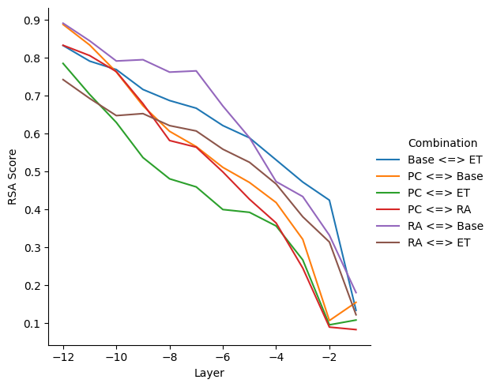
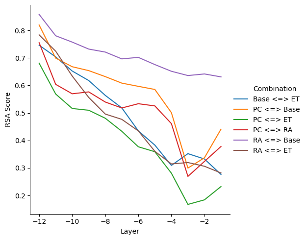
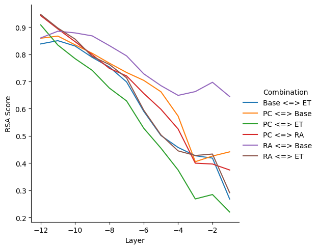
```

The inter-model similarity is evaluated by comparing layer-wise representations of models trained on different tasks using the same ALBERT architecture. Given the representations produced by two ALBERT models trained on different complexity-related annotations for all the sentences in the SST corpus, their similarity is evaluated using both RSA and PWCCA in three settings:

- **[CLS] token**: Only the sentence-level `[CLS]` initial embedding is considered when evaluating similarity at each layer for all sentences in the SST corpus.

- **Tokens' average**: A sentence-level embedding obtained by averaging all the individual subword embeddings produced by ALBERT is considered when evaluating similarity at each layer for all sentences in the SST corpus.

- **All tokens**: The subword embeddings produced by ALBERT for all SST sentences are considered when evaluating similarity at each layer, including `[CLS]`, `[SEP]` and regular token embeddings, for all sentences in the SST corpus. In practice, the number of considered embedding was set to a maximum of 50,000 to limit such an approach's computational costs.

\noindent
Figure \@ref(fig:rsa-inter) presents inter-model RSA scores for all model combinations and layers, going from the input layer after initial embeddings (-12) to the last layer before prediction heads (-1). 

Given the RSA similarity metric has range $[0,1]$,  it can be observed that representational similarity varies greatly across layers, ranging from very high ($\sim 0.9$) across bottom layers of the models to very low ($< 0.1$) for top layers. This observation supports the widely accepted claim that layers closer to the input in NLMs are almost unaffected by task-specific fine-tuning since they encode low-level properties, while layers closer to prediction heads represent task-related abstract knowledge and tend to diverge rapidly during training.

In settings involving the PC-trained model (yellow, red, and green lines in Figure \@ref(fig:rsa-inter)) no sharp decrease in similarity is observed across the top layer for all three variations. Conversely, spikes of decreasing similarity are observed for top layers of all other model pairs. While in terms of `[CLS]` all models behave comparably, there is a marked dissimilarity between PC and ET-trained models for top layers when considering all token representations, both with and without averaging (green line in Figures \@ref(fig:rsa-inter) a,b). Conversely, RA's `[CLS]` representations behave similarly to the ones of other models, but token representations stay very similar to Base even for top layers, i.e. are slightly affected by fine-tuning (purple line in Figures \@ref(fig:rsa-inter) b,c). It can be hypothesized that the RA-trained model cannot collect relevant token-level information since it misses the relative perspective that, as saw in Section \@ref(subsubchap:readability), plays a key role for readability assessment. In this case, PC and ET-trained models are the only ones building relevant complexity-related knowledge, but they still tend to diverge in terms of representational similarity.

(ref:pwcca-inter-caption-latex) Inter-model PWCCA distances across layers for all ALBERT models' combinations. Layer -1 corresponds to the last layer before prediction heads. Higher values denote weaker inter-model similarity.

(ref:pwcca-inter-caption-gitbook) Inter-model PWCCA distances across layers for all ALBERT models' combinations, using the [CLS] token (top-left), the all-token average (top-right), and all tokens (bottom) representations. Layer -1 corresponds to the last layer before prediction heads. Higher values denote weaker inter-model similarity.

```{r out.width = "50%", fig.align='center', fig.cap=ifelse(knitr::is_html_output(), "(ref:pwcca-inter-caption-gitbook)", "(ref:pwcca-inter-caption-latex)"), label="pwcca-inter", echo=FALSE, fig.ncol=2, fig.subcap=c('CLS token', "Tokens' average", 'All tokens')}
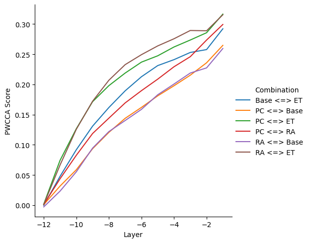
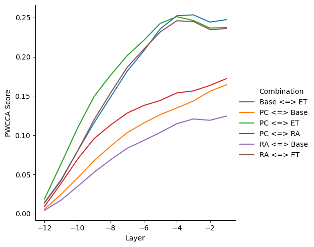
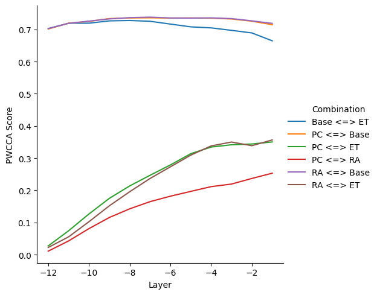
```

Figure \@ref(fig:pwcca-inter) presents PWCCA scores in the exact same setup as Figure \@ref(fig:rsa-inter). It does not come as a surprise that scores, in this case, tend to increase while moving towards prediction heads since the PWCCA distance on the $y$-axis represents here a function of representational dissimilarity between different layers. Besides this difference, a sharp contrast in behavior is observed in relation to RSA scores, with generally smaller value ranges ($\sim 0.0$ to $0.4$). 

In terms of `[CLS]` representations, (PC, Base) and (RA, Base) are the two closest pairs, while (PC, ET) and (RA, ET) are furthest. This relation can be rationalized if considering that PC and RA-trained models are trained using the `[CLS]` token representation for prediction and have relatively few annotations if compared to the token-level trained ET model. The contrast is even more pronounced when PWCCA distances are measured across token averages (Figure \@ref(fig:pwcca-inter) b). Here, pairs containing the ET model quickly diverge from the common trend and settle to a shared PWCCA distance for top layers. Finally, the comparison of all individual token representation contradicts previous RSA trends by showing a remarkably consistent divergence from Base representations at all layers for all the three complexity-trained models.

All in all, both RSA and PWCCA suggest an abstraction hierarchy where the closeness of a representation layer to prediction heads is proportional to the magnitude of changes in parameter values during the training process. While RSA similarity highlights a markedly different behavior for the readability-trained model, the more advanced PWCCA method indicates that representations of models trained with similar objectives stay close in parameter space throughout training, regardless of the conceptual proximity phenomena modeled by their loss functions.

### Intra-model Representational Similarity {#subsubchap:ex2-intra}

The intra-model similarity is evaluated in the same setting of the previous section. However, instead of comparing the same layer across two different models, the representations learned by all layer pairs inside the same model are compared using RSA and PWCCA. Again, the three perspectives of `[CLS]`, token's average, and all tokens introduced in the previous chapter are evaluated to understand the shift in representations across layers at different levels of granularity (two sentence-level and one token-level).

(ref:rsa-intra-base-caption-latex) Intra-model RSA scores across layers' combinations for the pre-trained ALBERT model without fine-tuning (**Base**). Layer -1 corresponds to the last layer before prediction heads. Higher values denote stronger inter-layer similarity.

(ref:rsa-intra-base-caption-gitbook) Intra-model RSA scores across layers' combinations for the pre-trained ALBERT model without fine-tuning (**Base**), using the [CLS] token (top-left), the all-token average (top-right), and all tokens (bottom) representations. Layer -1 corresponds to the last layer before prediction heads. Higher values denote stronger inter-layer similarity.

```{r out.width = "50%", fig.align='center', fig.cap=ifelse(knitr::is_html_output(), "(ref:rsa-intra-base-caption-gitbook)", "(ref:rsa-intra-base-caption-latex)"), label="rsa-intra-base", echo=FALSE, fig.ncol=2, fig.subcap=c('CLS token', "Tokens' average", 'All tokens')}
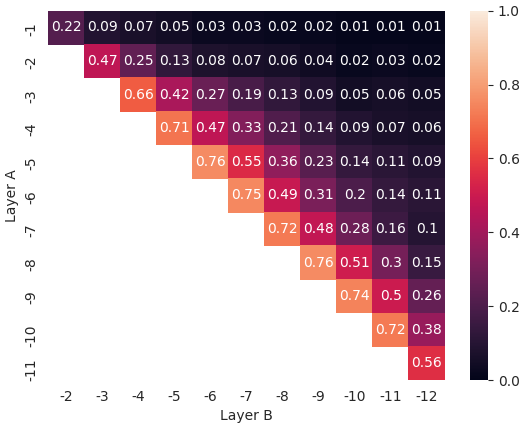
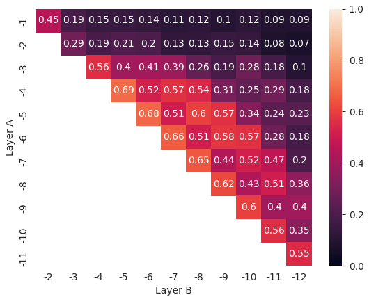
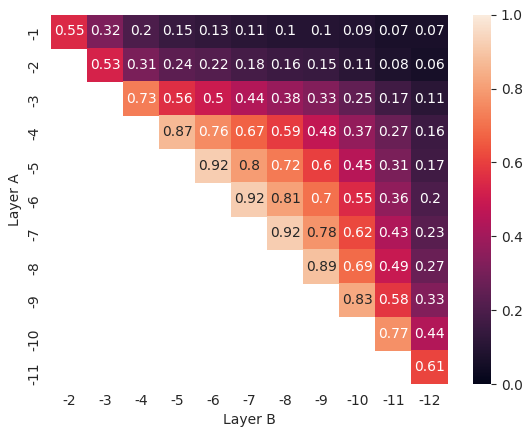
```

Figure \@ref(fig:rsa-intra-base) presents intra-model RSA similarity scores for all layer pairs of the Base model, going from the input layer after initial embeddings (-12) to the last layer before prediction heads (-1). Only the Base model results are presented in this chapter since they are very similar to those produced by fine-tuned models. The latter can be found in Appendix \@ref(app:intra-sim). The first insight relative to RSA intra-model results is that ALBERT layers tend to learn representations that are generally very similar to those of layers in their neighborhood, especially for layers found at the center and close to the input embeddings of the model. While in the case of `[CLS]` similarity scores fall sharply beyond the preceding/following layer for each layer, suggesting a significant variation in the information encoded across the model structure, the high-similarity range is much broader for tokens' average and all tokens representations. It is interesting to note that the top two layers (-1 and -2) are almost always very dissimilar in relation to the rest of the model, which is coherent with the spiking behavior around inter-model scores highlighted in the previous section. Another interesting observation is that, while `[CLS]` and all tokens' representations are consistently decreasing, the tokens' average representation similarity follows an undulatory behavior across middle layers for all the tested models, with similarity scores dropping and raising while moving away from reference layer. This fact further supports the evidence that token's sentence-level average may better integrate language information from lower layers into high-level representations, as highlighted by @miaschi-dellorletta-2020-contextual in the context of morphosyntactic knowledge.

(ref:pwcca-intra-base-caption-latex) Intra-model PWCCA distances across layers' combinations for the pre-trained ALBERT model without fine-tuning (**Base**). Layer -1 corresponds to the last layer before prediction heads. Higher values denote weaker inter-layer similarity.

(ref:pwcca-intra-base-caption-gitbook) Intra-model PWCCA distances across layers' combinations for the pre-trained ALBERT model without fine-tuning (**Base**), using the [CLS] token (top-left), the all-token average (top-right), and all tokens (bottom) representations. Layer -1 corresponds to the last layer before prediction heads. Higher values denote weaker inter-layer similarity.

```{r out.width = "50%", fig.align='center', fig.cap=ifelse(knitr::is_html_output(), "(ref:pwcca-intra-base-caption-gitbook)", "(ref:pwcca-intra-base-caption-latex)"), label="pwcca-intra-base", echo=FALSE, fig.ncol=2, fig.subcap=c('CLS token', "Tokens' average", 'All tokens')}
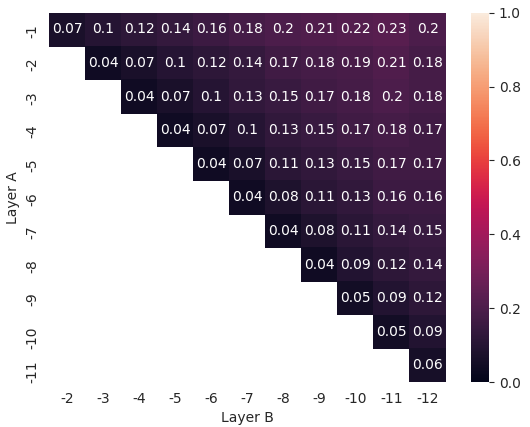
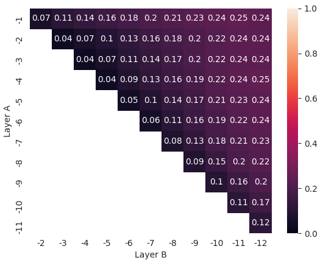
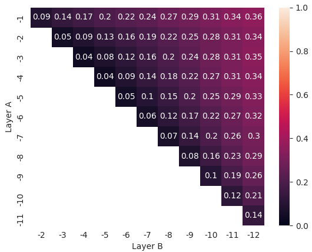
```

Figure \@ref(fig:pwcca-intra-base) presents PWCCA scores in the exact same setup as Figure \@ref(fig:rsa-intra-base). As in the previous section, the inverse trend in scores here is due to PWCCA being a dissimilarity measure, and the range of result scores is smaller than the one of RSA. Conversely to the previous setting, `[CLS]` representations stay closer across layers when their similarity is measured using PWCCA, and there are no significant spikes in score values. The latter finding is coherent with the effect of cross-layer parameter sharing adopted by ALBERT authors. Quoting @lan-etal-2020-albert: "We observe that the transition from layer to layer [in terms of L2 distances and cosine similarity] are much smoother for ALBERT than for BERT. These results show that weight-sharing affects stabilizing network parameters". In the context of `[CLS]` representations, the lowest layer (-12) appears to be slightly closer to the top layers than the subsequent ones. This fact ultimately supports the intuition that ALBERT is heavily overparametrized, and first-level embeddings already capture much information.

Again for intra-model similarity, PWCCA highlights an abstraction hierarchy inside ALBERT with smoother and generally more reasonable transitions than those showed by RSA. There is no reason to believe that ALBERT adapts its representation hierarchy as a function of its objective since intra-model similarity scores stay approximately the same before and after fine-tuning for all complexity corpora.

## Summary {#subchap:ex2-summary}

In this chapter, the representations learned by a neural language model fine-tuned on multiple complexity-related tasks were compared using two widely-used representational similarity approaches. Token and sentence-level representations were compared both considering the same layer across models exposed to different training corpora and different layer pairs contained in the same model. In the first case, the absence of a preponderant similarity between complexity-trained models when compared to the pre-trained one suggests that those models learn their objective by overfitting annotations and without being able to recognize useful primitives that could be recycled throughout complexity tasks. This fact is highlighted in the comparison between perceived complexity and eye-tracking-trained models, where similarity scores of layers close to prediction heads are very different despite the close relationship between the two complexity perspectives. In conclusion, this work strongly supports the claim that representation learning in ALBERT and other neural language models is mainly driven by training biases like task granularity (token-level vs. sentence-level) that are unrelated to the nature of the task itself. This fact hinders their generalization performances, suggesting that much work still needs to be done beyond language modeling to drive generalizable, hierarchical, and compositional representation learning in models of language.