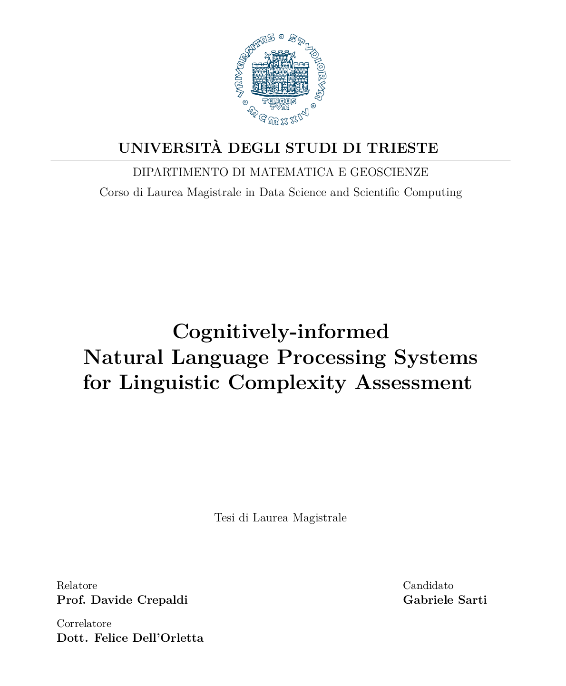

---
#########################################
# options for knitting a single chapter #
#########################################
output:
  bookdown::html_document2: default
  bookdown::word_document2: default
  bookdown::pdf_document2:
    template: templates/brief_template.tex
documentclass: book
#bibliography: references.bib
---
\titlespacing*{\chapter}{0pt}{0pt}{35pt}

<!-- this adds an image in gitbook output --> 

# **Introduction** {-}

<!-- Required since it is not a counted chapter otherwise -->
\markboth{Introduction}{}

\adjustmtc 
<!-- For PDF output, we must include this LaTeX command after unnumbered headings, otherwise the numbers in the mini table of contents will be incorrect -->

The study of complexity in language production and comprehension is a multidisciplinary field encompassing approaches that range from the analysis of cognitive processing phenomena in human subjects to the classification of structural complexity in natural language utterances. Because of its inherently faceted nature, linguistic complexity still defies a univocal definition and depends heavily on the point of view adopted during experimental inquiries. In recent years, as a consequence of the astounding expansion in human technological capabilities, the scientific community witnessed a proliferation of studies leveraging computational methods to investigate different complexity perspectives and develop automatic systems for linguistic complexity assessment. The introduction of neural network models able to automatically learn hierarchical representations of language spurred new lines of research in the field of Natural Language Processing, with researchers aiming to reverse-engineer theoretical intuitions by interpreting results and learning mechanics of those models. Nowadays, deep computational models are routinely adopted to study and evaluate linguistic complexity in applicative settings such as readability assessment, simplification, and first/second language learning.

<!--In this context, members of the Natural Language Processing community contributed to a broader overview of the topic by connecting the concepts of surprisal and perplexity to their information-theoretic equivalents.-->

This thesis fits into this current line of research by pursuing a two-fold aim. On the one hand, it investigates the connection between multiple human-centric perspectives of linguistic complexity -- perception of complexity, readability, cognitive processing, and predictability -- highlighting similarities and differences between them from a linguistically and cognitively-motivated viewpoint. On the other hand, it studies how those perspectives are learned by deep learning models at various levels of granularity. This work's primary focus concerns the analysis of learned representations using multiple interpretability techniques derived from the natural language processing (NLP) literature and the study of abstraction and generalization capabilities of modern computational models of language. A model-driven approach is adopted throughout this study, following the intuition that learned representations can be leveraged as proxies of the informational content required to perform linguistic complexity assessment. The modeling of linguistic complexity is studied on multiple extensively-used corpora spanning three complexity-related tasks -- *perceived complexity prediction, automatic readability assessment, and gaze metrics prediction* -- and further validated on ad-hoc psycholinguistic test suites. To further validate the impact of structural factors for complexity assessment, neural network-based annotation pipelines are notably employed alongside neural language models as black-box feature extraction systems.

Chapter \@ref(chap:ling-comp) marks the beginning of this work by introducing the reader to the multiple facets of linguistic complexity. It starts with a broad categorization of complexity measurements into a spectrum taking into account both the perspective of analysis (intrinsic or extrinsic) and the processing modalities (online or offline). Relevant intrinsic perspectives related to linguistic complexity are then briefly presented, focusing on the extraction and use of morphosyntactic structures in complexity studies and the use of information-theoretic surprisal from language models as a structural measure of complexity. The three extrinsic complexity tasks representing this study's focus and their respective corpora are introduced in detail, focusing on their differences both from a conceptual and a data collection perspective. The chapter ends with an introduction to *garden-path sentences*, peculiar syntactic constructs associated with cognitive processing difficulties, later employed in the experiments of Chapter \@ref(chap:ex3).

Chapter \@ref(chap:models) motivates the choice of NLMs as the critical component in our experimental analysis: their ability to encode both semantic and structural properties of language makes them especially suitable in the context of linguistic complexity modeling. After a summary of the ascent of NLMs in the field of NLP, the two neural language models used in experimental sections are presented in detail. To conclude, three interpretability approaches are used to leverage learned representations to study complexity learning across tasks, and abstraction layers are presented.

Chapter \@ref(chap:ex1) is the first experimental section, in which perceived complexity annotations and eye-tracking metrics collected at sentence level are linked to various linguistic phenomena extracted by a linguistic parser. The same analysis is also performed by controlling sentence length to limit the disproportionate influence of length-related features on complexity measures. The predictive performances of NLMs are then evaluated on perceived complexity and various eye-tracking metrics for both length-controlled and unconditional settings. The chapter ends with probing task experiments highlighting how complexity-related linguistic properties become implicitly encoded in model representations after complexity learning, suggesting interesting perspectives in priming models with syntactic information to improve their performances on complexity-related tasks.

Chapter \@ref(chap:ex2) builds upon previous chapters' intuitions to compare the contextual embeddings generated from a single corpus by multiple models trained on the different complexity-related tasks. First, a set of assumptions is formulated to guide the empirical evaluation of how models encode complexity properties after fine-tuning. Similarity scores are then computed layer-wise across language models using two interpretability approaches to evaluate whether the information shared across different complexity perspectives is encoded by models with different fine-tuning objectives. Finally, learned representations are compared across model layers and fine-tuning tasks to highlight whether and how fine-tuning objectives influence the abstraction hierarchy learned by language models.

Chapter \@ref(chap:ex3) concludes the experimental portion of this work by studying the connection between eye-tracking metrics and language modeling surprisal and investigating whether gaze metrics fine-tuning can enable language models to individuate cognitive processing triggers like garden-path sentences. A data-driven strategy is first adopted to establish a conversion coefficient between surprisal units and reading times. This coefficient is then used to evaluate whether a model that correctly highlights increased cognitive processing in specific constructions can also predict the magnitude of such phenomena.  Autoregressive and masked language models are fine-tuned on eye-tracking measurements and then leveraged in a zero-shot setting to evaluate their ability in replicating garden-path effects in a controlled setting. Finally, models' performances are evaluated on a set of psycholinguistic benchmarks using surprisal and gaze recordings predictions to estimate the presence and magnitude of garden-path effects.

While studies on natural language complexity usually adopt a cross-lingual perspective, either by performing typological comparisons across language families or studying the impact of interlingual contacts on complexity changes, this work focuses solely on analyzing complexity annotations produced by native speakers of English. The English language was selected due to the broad availability of open-source corpora and resources, and no other languages were included in the study to keep it as self-contained as possible. Readers should be aware that English is widely considered morphologically and inflectionally poor despite its ubiquity in language studies, even compared to its Indo-European siblings. It should thus be avoided to generalize the results of this thesis work to other language families and typologies.^[See @ruder-2020-beyond for the importance of multilingual studies in NLP.] Moreover, this study focuses on the written language paradigm, but the importance of phonological phenomena in spoken language in evaluating language complexity is acknowledged [@mcwhorter-2001-world]. 

This thesis work should be regarded as a broad, high-level exploration of multiple linguistic complexity perspectives employing modern computational approaches. In this sense, both introductory and experimental chapters are not intended to be exhaustive in providing a complete overview of the discussed topics. Instead, they aim to provide the minimal context needed to interpret experimental results correctly. Introductory chapters include pointers to additional resources discussing linguistic complexity for curious readers, and future studies on these topics will likely encompass any other perspective that was not covered by the present work.

